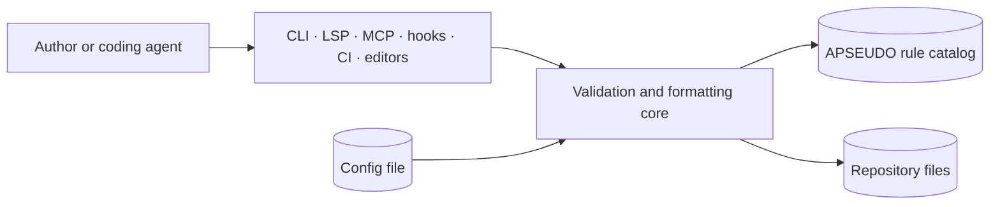
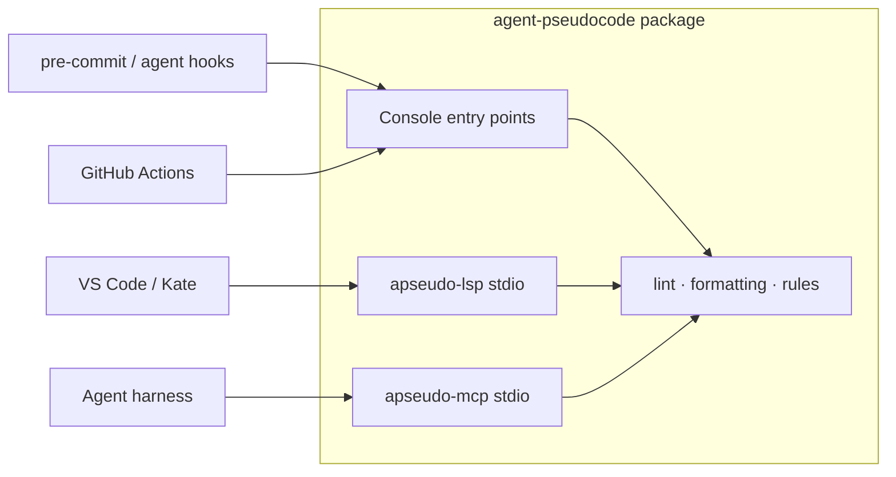
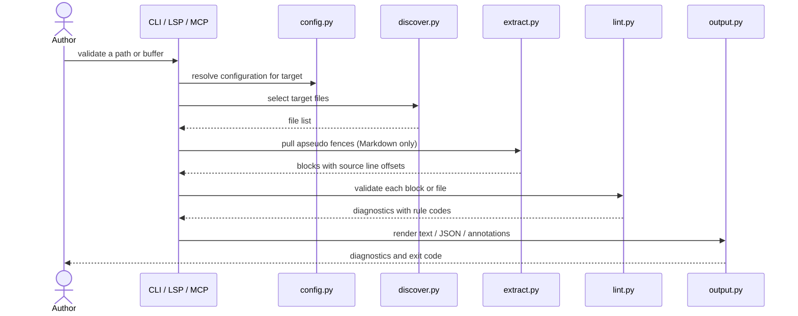

# `Agent Pseudocode Validation Toolchain` — Specification (Standard)

---

## Revision History

| Version | Date | Author | Change |
| --- | --- | --- | --- |
| 0.1 | `2026-07-22` | Chris Purcell | Initial draft, reverse-engineered from the shipped toolchain. |

**Spec lifecycle:** This document is **living until `approved`**, then **change-controlled**: post-approval edits require a new revision row and, for scope-affecting changes, re-approval by the owner. Implementation deviations are recorded in the [Deviations Log](#deviations-log), not silently patched into requirements. When replaced, set `status: superseded` and `superseded_by:` in the frontmatter.

---

## 1. Purpose & Background

Pythonic Agent Pseudocode is a convention for writing agent workflows as structured, reviewable process definitions rather than prose. Prose workflows drift: a bounded retry loop becomes unbounded, a failure branch loses its terminal outcome, and nobody notices until an agent loops forever or silently swallows an error. The convention exists so those defects are mechanically detectable.

A convention nobody can check is a style guide. This subsystem is what makes it enforceable: a validator that decides whether a document conforms, and a formatter that normalizes the physical form so review diffs carry meaning instead of whitespace churn.

The compounding risk this specification addresses is not "the linter has a bug" — it is **policy divergence**. The convention is consumed through at least eight surfaces: a CLI, a language server, an MCP server, agent hooks, pre-commit hooks, CI, a VS Code extension, and a Kate integration. If any of them reimplements a rule, the convention silently forks: an author sees a clean editor while CI rejects the same file, and the rule catalog stops being authoritative. The durable asset here is a single decision point that every surface is obliged to call.

After successful implementation, an author writing agent pseudocode gets the same verdict, the same rule code, and the same explanation from whichever surface they happen to be using, and any repository can adopt the convention by installing one package.

Scope for this release is the validation and formatting core plus its reuse contract. The executable runner that hands scripts to a live agent is a separate subsystem with its own safety model, deliberately deferred to its own specification (see [§2.3](#23-wont-have-in-v1-deferred--not-never)).

---

## 2. Scope

### 2.1 In Scope

- Validating `.apseudo`, `.agentpseudo`, and `.pseudocode` files against the APSEUDO-\* rule catalog.
- Validating `apseudo`-fenced code blocks embedded in Markdown.
- Formatting the same file and fence types: indentation, blank-line collapsing, normative-keyword casing.
- The rule catalog as the single explanation layer for every consuming surface.
- Configuration discovery and precedence.
- Repository-level completeness review (`apseudo-review`).
- Diagnostic output formats: human text, JSON, and GitHub Actions annotations.
- The reuse contract that binds the LSP, MCP, hook, pre-commit, CI, and editor surfaces to the core modules.
- Mermaid rendering of a validated process, as a read-only visualization.

### 2.2 Out of Scope (Non-Goals — never)

| ID | Non-Goal | Reason |
| --- | --- | --- |
| NG-001 | Executing pseudocode as a program | Agent Pseudocode is a process contract for a reader, not an interpreted language. An execution semantics would make the convention a language to maintain. |
| NG-002 | Auto-fixing rule violations | Every APSEUDO-\* rule concerns intent — a missing loop bound or absent terminal outcome. A machine cannot infer the author's bound; guessing one is worse than failing. |
| NG-003 | Formatting non-pseudocode file types | Prettier owns physical formatting for Markdown, JSON, JSONC, and YAML. A second formatter over the same bytes produces fights, not consistency. |
| NG-004 | Translating pseudocode to or from Python, Bash, or another language | The convention's value is that it is _not_ code; a transpiler would invite readers to treat it as an implementation. |
| NG-005 | Network access from the validator, formatter, LSP, or MCP server | These run inside editors and agent harnesses on unreviewed input. Offline operation is the trust boundary. |

### 2.3 Won't Have in v1 (deferred — not never)

| ID | Deferred Capability | Why Deferred | Revisit When |
| --- | --- | --- | --- |
| WH-001 | Executable runner (`apseudo-run`) specification | It ships in the same package but has a distinct safety model — agent invocation, sandbox modes, diff policy, run records. Folding it in would double this spec and mix two trust boundaries. | The runner's interface stabilizes; then author a sibling spec and cross-reference. |
| WH-002 | User-defined or repository-local custom rules | The catalog is small enough that shared vocabulary is worth more than extensibility. A plugin surface would fork the convention per repository. | A consuming repository demonstrates a rule the shared catalog cannot express. |
| WH-003 | Severity overrides per rule in configuration | `--strict`, `--fail-on-warnings`, and `--errors-only` already cover the useful policy range without per-rule bikeshedding. | A consumer needs to adopt the convention incrementally on a large legacy corpus. |
| WH-004 | Published rule-catalog schema for third-party consumers | `apseudo-explain --json` and the MCP `list_rules` tool expose the catalog, but the field set is not yet contract-stable. | An external consumer depends on the shape; then version it explicitly. |

### 2.4 Boundaries

| Boundary | Description |
| --- | --- |
| System owns | The APSEUDO-\* rule catalog and its wording; parsing and validation of pseudocode; formatting of pseudocode; configuration discovery; diagnostic shape and exit codes. |
| System depends on | Python 3.14+; the filesystem; Git, only for `--changed` discovery; the host editor or agent harness for LSP and MCP transport. |
| System does not own | Markdown/JSON/YAML physical formatting (Prettier); Markdown structure (markdownlint); frontmatter schemas (Markdown Frontmatter); the convention's prose definition, which lives in `docs/reference/PYTHONIC_PSEUDOCODE_STANDARD.md`. |

---

## 3. Context

### 3.1 Current State

The toolchain is implemented and shipped in `agent-pseudocode` version 0.6.1 as the `apseudo_lint` package. This specification is reverse-engineered from that implementation to give the existing behavior a testable contract, not to propose new work.

The core modules are `lint.py` (validation), `formatting.py` (formatting), `rules.py` (catalog), `config.py` (discovery), `discover.py` (file selection), `model.py` (parsed representation), `extract.py` (Markdown fence extraction), and `output.py` (diagnostic rendering). Consumer surfaces are `cli.py`, `format_cli.py`, `review_cli.py`, `explain_cli.py`, `template_cli.py`, `mermaid_cli.py`, `main_cli.py`, `lsp.py`, and `mcp.py`, plus `integrations/agent-hooks`, `.pre-commit-hooks.yaml`, `products/vscode-extension`, and `products/kate-integration`.

The catalog holds 20 rules across 11 families — `ACTION`, `BRANCH`, `FOR`, `IO`, `NEST`, `NORM`, `OUTCOME`, `PARSE`, `PROC`, `RETURN`, `WHILE` — at two severities, `error` and `warning`.

Known limitations at the time of writing: line coverage is 62% against an 85% floor that the managed gate now enforces; three defects remain open in `docs/handoff/bugs/` (stale MCP resource paths, stale completeness-check paths, an unguarded LSP message read); and the reuse contract is stated in `CLAUDE.md` and `AGENTS.md` but is not enforced by any test.

### 3.2 Target State

Behavior is unchanged, but constrained: the reuse contract is expressed as a requirement with a verification, coverage meets the tooling standard's floor, and the three open defects are closed. A reader can determine from this document what the toolchain guarantees without reading the implementation.

### 3.3 Assumptions

| ID | Assumption | Impact if False |
| --- | --- | --- |
| A-001 | The rule catalog stays small enough that a shared vocabulary beats extensibility. | WH-002 is pulled forward; the catalog needs a plugin surface and a compatibility policy. |
| A-002 | Consumers run Python 3.14 or newer. | The package needs a lower floor and must drop the syntax and typing features it currently relies on. |
| A-003 | Pseudocode documents are small — hundreds of lines, not millions. | NFR-001's whole-repository latency target becomes unreachable and validation needs incremental or parallel execution. |
| A-004 | Editors and agent harnesses invoke the LSP and MCP servers over stdio. | A second transport must be specified, and the offline trust boundary in NG-005 needs re-examination. |

### 3.4 Constraints

| ID | Constraint | Source |
| --- | --- | --- |
| C-001 | The validator and formatter are the sole policy source; no other surface may implement a rule. | Repository architecture rule in `CLAUDE.md` and `AGENTS.md` |
| C-002 | Python 3.14+, uv for environments, Ruff for lint/format, BasedPyright in strict mode, pytest with coverage, pip-audit. | The `python-coding` and `python-tooling` standards |
| C-003 | No new runtime dependencies without explicit justification; the package must stay installable in a bare virtual environment. | Repository design rule — the tool runs inside other repos' hooks |
| C-004 | Pseudocode indents 4 spaces, contrary to the repository's `tab` default for other file types. | `.editorconfig`, and the convention's Python-like reading |
| C-005 | Diagnostics must be renderable as GitHub Actions annotations. | CI integration requirement |

---

## 4. Goals

| ID | Goal | Success Signal | Achieved By |
| --- | --- | --- | --- |
| G-001 | One verdict for a given document, whatever surface asks. | The same file yields the same rule codes from CLI, LSP, MCP, hooks, and CI. | FR-001, FR-002, FR-010, NFR-004 |
| G-002 | A failing check tells the author what to change, not merely that something is wrong. | Every emitted code resolves to a catalog entry with a rationale, a compliant example, and a fix. | FR-006, FR-007 |
| G-003 | Formatting never changes meaning. | Formatting is idempotent, and no formatting-only change alters the set of diagnostics for the same document. | FR-004, FR-005, NFR-002 |
| G-004 | Adoption costs one install and one config file. | A repository gains validation via pre-commit or CI without copying rule logic. | FR-008, IR-001, IR-004 |
| G-005 | The tool is safe to run on untrusted input inside an editor or agent harness. | No network access; no execution of document content. | NG-005, NFR-005 |

---

> **§5 (Stakeholders and Users) is Full-tier** and is intentionally omitted at the Standard profile.

## 6. Glossary

| Term | Definition | Notes / Not to be confused with |
| --- | --- | --- |
| Agent Pseudocode | The convention defined in `docs/reference/PYTHONIC_PSEUDOCODE_STANDARD.md` for expressing agent workflows. | Not a programming language and not executable — see NG-001. |
| Process | A named, callable unit declared `process name(...):`; the top-level structure of a pseudocode document. | Not an OS process. |
| Terminal outcome | An explicit end state a process can reach, such as `Accepted`, `Blocked`, or `NeedsUserDecision`. | Not a return value; a process may declare outcomes without returning data. |
| Bounded loop | A repetition construct with a statically evident maximum iteration count. | An unbounded `while` is the defect the `WHILE` rule family exists to catch. |
| Rule | One catalog entry: a stable `APSEUDO-*` code, severity, summary, rationale, compliant and non-compliant examples, and fix. | Distinct from a _diagnostic_, which is one occurrence of a rule at a location. |
| Fence | A Markdown fenced code block tagged `apseudo`, validated as if it were a standalone document. | Not every fenced block — only the tagged language. |
| Normative keyword | `MUST`, `SHOULD`, or `MAY` appearing in a pseudocode comment, carrying RFC 2119-style force. | The formatter uppercases these; `--no-uppercase-normative` disables that. |
| Executable pseudocode | A `.apseudo` script with a shebang and runner frontmatter, intended for `apseudo-run`. | Out of scope here (WH-001), though the same validator checks its body. |
| Policy source of truth | The `lint.py`, `formatting.py`, and `rules.py` modules, whose verdicts every other surface must reuse. | Not the CLI — the CLI is one consumer among several. |

---

## 7. Requirements

### 7.1 Functional Requirements

| ID | Requirement | Rationale | Acceptance Criteria | Priority |
| --- | --- | --- | --- | --- |
| FR-001 | The system shall validate `.apseudo`, `.agentpseudo`, and `.pseudocode` files against the rule catalog and emit one diagnostic per violation, carrying code, severity, path, and line. | A diagnostic without a location cannot be acted on. | Each fixture in `tests/fixtures/` yields exactly its expected diagnostic set. | Must |
| FR-002 | The system shall extract and validate `apseudo`-fenced blocks in Markdown, reporting locations relative to the containing Markdown file. | Most pseudocode in this repository lives in documentation, not standalone files. | A Markdown file with a known-bad fence reports the violation at the fence's line in the `.md` file, not line 1 of the fence. | Must |
| FR-003 | The system shall discover target files from explicit paths, from directory recursion, or — with `--changed` — from Git's changed-file set, defaulting to the current directory. | Hooks need the changed set; CI needs the whole repository. | `--changed` in a repository with one modified pseudocode file processes exactly that file. | Must |
| FR-004 | The system shall format pseudocode by normalizing indentation, collapsing consecutive blank lines beyond a configured maximum, and uppercasing normative keywords in comments. | Whitespace churn hides semantic changes in review. | Formatting a known-unformatted fixture produces the expected bytes. | Must |
| FR-005 | Formatting shall be idempotent: formatting already-formatted output shall produce identical bytes. | A non-idempotent formatter makes `--check` unstable and CI flaky. | For every fixture, `format(format(x)) == format(x)`. | Must |
| FR-006 | The system shall expose, for every rule code, a title, severity, summary, rationale, compliant example, non-compliant example, and fix. | G-002 — a code alone does not tell an author what to do. | `apseudo-explain --json` returns all catalog fields for all rules; every field is non-empty. | Must |
| FR-007 | The system shall reject an unknown rule code with a usage error rather than silently returning nothing. | A typo in a rule code must not look like "no guidance exists". | `apseudo-explain` given a code absent from the catalog exits 2 and names that code on standard error. | Must |
| FR-008 | The system shall discover configuration from `.apseudo-lint.toml`, `apseudo.toml`, then `[tool.apseudo_lint]` in `pyproject.toml`, searching upward from each target. | Repositories differ in where they keep tool configuration. | A fixture repository with each file form resolves the expected settings in the documented precedence. | Must |
| FR-009 | The system shall emit diagnostics as human text, JSON, or GitHub Actions annotations, selected by `--format`. | C-005; and machine consumers must not parse human output. | `--format json` output parses and contains one object per diagnostic; `--format github` matches the annotation syntax. | Must |
| FR-010 | Every consumer surface — CLI, LSP, MCP, agent hooks, pre-commit, CI, and editor integrations — shall obtain verdicts and rule text by calling the core modules. | C-001; this is the requirement the whole architecture exists to protect. | No module outside `lint.py`, `formatting.py`, and `rules.py` defines a rule code or severity; verified by NFR-004's test. | Must |
| FR-011 | The system shall report repository-level convention completeness via `apseudo-review`, in Markdown or JSON. | Adoption gaps are invisible to a per-file linter. | `apseudo-review --json` on this repository returns a parseable report naming each checked artifact and its status. | Should |
| FR-012 | The system shall emit starter templates for common workflow shapes, listable and individually retrievable, in text or JSON. | A correct starting point prevents the most common violations. | Every listed template validates clean under FR-001 with zero diagnostics. | Should |
| FR-013 | The system shall render a validated process as a Mermaid flowchart, with or without Markdown fences. | Reviewers reason about branching faster from a diagram. | `apseudo-mermaid --no-fence` on a fixture emits parseable Mermaid with no surrounding fence. | Should |
| FR-014 | Severity policy shall be selectable via `--strict`, `--fail-on-warnings`, and `--errors-only` without editing the catalog. | WH-003 — policy varies by repository maturity; rule meaning must not. | Each flag changes the exit code as documented for a fixture with one warning and one error. | Should |
| FR-015 | The system shall accept a document on standard input, with `--stdin-filename` supplying the path used for extension and configuration resolution. | Editors format buffers that have never been written to disk. | Piping a fixture with `--stdin-filename f.apseudo` yields the same diagnostics as validating the file. | Should |

### 7.2 Non-Functional Requirements

| ID | Category | Requirement | Measurement / Acceptance Criteria | Priority |
| --- | --- | --- | --- | --- |
| NFR-001 | Performance | The system shall validate this repository's full corpus fast enough to sit in a pre-commit hook without perceptible delay. | `apseudo-lint .` completes in under 5 seconds on the reference workstation. | Must |
| NFR-002 | Reliability | The system shall not modify a file when invoked in a non-mutating mode. | `--check` and `--diff` leave every byte and mtime untouched; asserted by test. | Must |
| NFR-003 | Maintainability | Line coverage shall meet the Python Tooling floor. | `pytest` coverage reports at least 85%. | Must |
| NFR-004 | Maintainability | Rule codes and severities shall be defined in exactly one module. | A test asserts no `APSEUDO-` literal defining a code exists outside `rules.py`. | Must |
| NFR-005 | Security | The system shall make no network request and shall not execute document content in any validation, formatting, LSP, MCP, or review path. | No socket or subprocess-of-content call in those paths; NG-005 upheld by review and test. | Must |
| NFR-006 | Observability | Diagnostics shall carry a stable rule code that survives wording changes. | Renaming a rule title in the catalog changes no code; asserted by test. | Should |
| NFR-007 | Portability | The system shall run on Linux, macOS, and Windows with no platform-specific code path in the core modules. | CI passes on all three, or the gap is recorded as a deviation. | Could |
| NFR-008 | Compatibility | The JSON diagnostic shape shall not change incompatibly within a minor version. | A schema-shape test pins the field set. | Should |

### 7.3 Interface Requirements

| ID | Interface | Requirement | Contract / Format | Acceptance Criteria |
| --- | --- | --- | --- | --- |
| IR-001 | CLI | The system shall expose `apseudo` plus per-command entry points, so that `apseudo lint` and `apseudo-lint` name the same command. | `docs/usage.md`; exit codes 0 success, 1 failing diagnostics, 2 usage error. | `apseudo lint .` and `apseudo-lint .` produce identical output and exit codes. |
| IR-002 | Language Server | The system shall serve diagnostics, hovers, completions, and document symbols over LSP on stdio. | LSP 3.17 over stdio; hover content is the rule's catalog Markdown. | An initialize/didOpen/hover exchange returns the same text as `apseudo-explain`. |
| IR-003 | MCP Server | The system shall expose validation, formatting, explanation, template, review, and Mermaid tools over MCP on stdio. | MCP over stdio; `list_rules` returns the catalog as JSON objects. | An initialize plus `validate_text` call returns the same diagnostics as the CLI. |
| IR-004 | pre-commit | The system shall publish `apseudo-format`, `apseudo-lint`, and `apseudo-review` hook definitions. | `.pre-commit-hooks.yaml`. | A consuming repository installs the hooks and they run against changed files only. |
| IR-005 | GitHub Actions | The system shall emit CI annotations attached to the correct file and line. | `--format github` workflow-command syntax. | A seeded violation appears as an annotation on the right line in a CI run. |
| IR-006 | Configuration file | The system shall read settings from the discovered configuration file. | TOML; `[tool.apseudo_lint]` when inside `pyproject.toml`, top-level otherwise. | Each documented key changes behavior as specified. |
| IR-007 | Editor integrations | The VS Code extension and Kate integration shall provide syntax highlighting and delegate all diagnostics to the language server. | TextMate grammars; LSP client configuration. | Neither product contains rule logic; verified by NFR-004's test. |

This system exposes no HTTP API, so no OpenAPI document applies.

### 7.4 Data Requirements

| ID | Data Entity | Requirement | Validation Rules | Ownership |
| --- | --- | --- | --- | --- |
| DR-001 | Rule catalog | The system shall hold the catalog in-process as immutable records. | Codes unique and stable; every field non-empty; severity in {`error`, `warning`}. | `rules.py` |
| DR-002 | Parsed document | The system shall build an in-memory representation of a document for validation and rendering. | Discarded after the run; never persisted. | `model.py` |
| DR-003 | Configuration | The system shall resolve configuration per target and hold it in memory for the run. | Unknown keys reported, not silently ignored; invalid values are usage errors. | `config.py` |
| DR-004 | Diagnostic record | The system shall represent each diagnostic with code, severity, path, line, column, and message. | Machine-readable in JSON; stable field names within a minor version (NFR-008). | `model.py`, `output.py` |

The toolchain owns no durable data: it reads files, writes formatted files only when explicitly asked, and persists nothing else. Retention, migration, backup, and privacy classification therefore do not apply.

---

## 8. Architecture and Design

### 8.1 Architecture Summary

The design is a policy core with a ring of thin adapters, and its single defining constraint is that the ring must never make policy.

At the center, `rules.py` holds the catalog, `lint.py` decides conformance, and `formatting.py` decides physical form. Around them sit supporting modules that feed the core rather than judge: `config.py` resolves settings, `discover.py` selects files, `extract.py` pulls `apseudo` fences out of Markdown so a fence can be validated exactly like a standalone document, `model.py` carries the parsed representation, and `output.py` renders diagnostics into text, JSON, or GitHub annotation syntax.

Outside that sits every consumer: the CLI entry points, the language server, the MCP server, agent hooks, pre-commit hooks, CI workflows, and the two editor products. Each translates a protocol into a core call and translates the result back. None of them decides anything.

Control flow is uniform regardless of entry point: resolve configuration, discover targets, extract fences where the target is Markdown, validate or format, render. Data flows one way — nothing downstream of `output.py` feeds back into a verdict.

The trust boundary is the process itself. These tools run inside editors and agent harnesses over input the user has not reviewed, so the core makes no network request and never executes document content (NG-005, NFR-005). That constraint is what makes it safe to wire the language server into an editor that opens arbitrary repositories.

The two decisions that most shaped this are D-001, the single-policy-source rule, and D-003, the choice to fail rather than auto-fix.

### 8.2 Architecture Views

#### 8.2.1 Context View

#### 8.2.2 Container / Deployment View

The toolchain is a single installable Python package with no server, database, or scheduled work. Its "deployments" are process invocations.

#### 8.2.3 Component View

| Component | Responsibility | Interfaces | Notes |
| --- | --- | --- | --- |
| `rules.py` | Owns the catalog and its rendering. | `list_rules`, `get_rule` | The only place a rule code or severity may be defined (NFR-004). |
| `lint.py` | Decides conformance. | Called by every surface | Pure with respect to the filesystem; takes text, returns diagnostics. |
| `formatting.py` | Decides physical form. | Called by formatter surfaces | Must be idempotent (FR-005). |
| `config.py` | Resolves configuration. | `CONFIG_FILENAMES` precedence | Searches upward per target; unknown keys are reported, not ignored. |
| `discover.py` | Selects target files. | Paths, recursion, `--changed` | Git is used only here, and only for changed-file discovery. |
| `extract.py` | Pulls `apseudo` fences from Markdown. | Used before validation | Maps fence-relative lines back to Markdown lines (FR-002). |
| `output.py` | Renders diagnostics. | text / JSON / GitHub | Rendering only; never suppresses or reclassifies a diagnostic. |
| `lsp.py` | Language server adapter. | LSP 3.17 stdio | Hover text comes from `rules.py`, never from a local string. |
| `mcp.py` | MCP server adapter. | MCP stdio | Serializes catalog records with `dataclasses.asdict`. |
| `review.py` | Repository completeness checks. | `apseudo-review` | Checks adoption artifacts, not document conformance. |
| `mermaid.py` | Flowchart rendering. | `apseudo-mermaid` | A read-only view; explicitly not authoritative over the pseudocode. |

### 8.3 Design Decisions

| ID | Decision | Rationale | Alternatives Considered | ADR |
| --- | --- | --- | --- | --- |
| D-001 | Validator and formatter are the sole policy source; adapters must reuse them. | Eight surfaces consume the convention. Any duplicated rule forks it silently and makes the catalog non-authoritative. | Per-surface reimplementation (rejected: guaranteed divergence); a shared rule-definition file each surface interprets (rejected: interpretation is where divergence enters). | Repository rule; no ADR yet — see OQ-002. |
| D-002 | Markdown fences are validated as first-class documents. | The majority of this repository's pseudocode is documentation-embedded; excluding it would leave the corpus unchecked. | Standalone files only (rejected: leaves most content unvalidated); a separate Markdown-specific rule set (rejected: forks the catalog). | — |
| D-003 | Rules fail rather than auto-fix. | Every rule concerns intent — a missing loop bound, an absent terminal outcome. A machine cannot infer the intended bound. | Auto-fix with defaults (rejected: fabricates intent, and a wrong bound is worse than none); interactive fix (rejected: unusable in CI). | — |
| D-004 | Formatting is separate from validation. | Lets `--check` be safe in CI and keeps whitespace churn out of semantic review. | One combined command (rejected: conflates a safe read with a write). | — |
| D-005 | Prettier owns Markdown, JSON, and YAML formatting; this toolchain owns only pseudocode. | Two formatters over the same bytes fight indefinitely. | Formatting Markdown here too (rejected: NG-003). | `adr-0003-markdown-frontmatter-scope-and-conventions` (adjacent scope) |
| D-006 | Catalog records are frozen slots dataclasses. | Immutability suits a static catalog and slots keep per-rule overhead low. | Plain dicts (rejected: no field discipline). Note the cost: slots removes `__dict__`, which caused bug 006 — serialize with `asdict`. | — |

### 8.5 Design Constraints

- No consumer surface may define a rule code, a severity, or rule-explanation prose.
- The core must not import any adapter module; dependencies point inward only.
- No new runtime dependency without justification against C-003.
- Formatting must never alter the diagnostic set for a document (G-003).
- Serialize catalog dataclasses with `dataclasses.asdict`, never `__dict__` (D-006).

---

## 9. Data Model

The toolchain owns no persistent storage. All state is process-local and discarded on exit, so schemas, migrations, indexes, retention, and archival do not apply.

Three in-memory structures carry the run, defined in `rules.py` and `model.py`:

- **Rule** — the catalog record: `code`, `title`, `severity`, `summary`, `rationale`, `compliant_example`, `noncompliant_example`, `fix`, `source`. `code` is the natural key and is unique and stable; a title may be reworded without changing it (NFR-006).
- **Parsed document** — processes, blocks, loops, branches, and outcomes, each retaining its source line so a diagnostic can point at it.
- **Diagnostic** — `code`, `severity`, `path`, `line`, `column`, `message`. This is the only structure with an external contract, since `--format json` exposes it (NFR-008).

The one durable artifact is `docs/reference/RULES.md`, a committed rendering of the catalog. It is derived, not authoritative: `rules.py` is the source, and the Markdown must be regenerated when the catalog changes (see OQ-001).

---

## 10. Behavior and Workflows

### 10.1 Primary Workflow

Steps:

1. Resolve configuration by searching upward from each target through `.apseudo-lint.toml`, `apseudo.toml`, then `pyproject.toml`.
2. Select targets from explicit paths, directory recursion, or Git's changed set.
3. For Markdown targets, extract `apseudo` fences and record each fence's line offset.
4. Validate each unit against the catalog.
5. Render diagnostics in the requested format.
6. Exit 0 if nothing failed under the active severity policy, 1 if something did, 2 on a usage error.

Expected result:

> Every violation is reported once, with a stable code and a location that resolves in the file the author edits.

### 10.2 Alternate Workflows

| ID | Trigger | Behavior | Expected Result |
| --- | --- | --- | --- |
| AW-001 | `--format` given | Normalize physical form instead of validating. | Files rewritten, or diffs printed under `--diff`, or exit 1 under `--check`. |
| AW-002 | `--changed` given | Restrict discovery to Git's changed-file set. | Only changed supported files processed; clean tree processes nothing. |
| AW-003 | Input arrives on standard input | Treat `--stdin-filename` as the notional path for extension and config resolution. | Same verdict as validating that file on disk (FR-015). |
| AW-004 | `--errors-only` / `--strict` | Reclassify what counts as failure without changing rule meaning. | Exit code changes; the diagnostic set does not. |
| AW-005 | Editor requests a hover | Return the catalog entry for the code under the cursor. | Identical text to `apseudo-explain` for that code (IR-002). |

### 10.3 Edge Cases

| ID | Edge Case | Expected Behavior |
| --- | --- | --- |
| EC-001 | Markdown file with no `apseudo` fence | Processed successfully with zero diagnostics; not an error. |
| EC-002 | Empty file, or a file of only comments | Zero diagnostics; the absence of a process is not itself a violation. |
| EC-003 | `apseudo` fence that is unparseable | A `PARSE`-family diagnostic at the fence's line in the Markdown file, not a traceback. |
| EC-004 | `--changed` outside a Git repository | Usage error with an explanatory message, exit 2; never a silent empty run that looks like success. |
| EC-005 | Configuration file with an unknown key | Reported to the author rather than silently ignored (DR-003). |
| EC-006 | File with CRLF line endings, or a missing final newline | Validated normally; the formatter normalizes per `.editorconfig` without reporting a rule violation. |
| EC-007 | Non-UTF-8 bytes | A clear decoding error naming the file, exit 2; never a traceback. |
| EC-008 | Path is a symlink or lies outside the repository | Resolved and processed, or refused with a clear message; never traversed silently outside the root. |
| EC-009 | Both `--check` and `--write` given to the formatter | Usage error, exit 2 — the request is contradictory. |

### 10.4 State Transitions

The toolchain is stateless: each invocation is independent and leaves no state behind. This section does not apply.

---

## 11. UI Pages / API Endpoints

Not applicable — the system exposes no UI and no HTTP API. Its CLI, LSP, MCP, hook, and configuration surfaces are specified as interface requirements in [§7.3](#73-interface-requirements) and documented in `docs/usage.md`.

---

## 12. Error Handling and Recovery

### 12.1 Expected Failures

| ID | Failure Mode | User/System Behavior | Logging / Observability | Recovery |
| --- | --- | --- | --- | --- |
| ERR-001 | Document violates one or more rules | Diagnostics rendered; exit 1 under the active severity policy. | Rule code, severity, path, line on stdout. | Author fixes the document; no tool-side recovery. |
| ERR-002 | Unparseable pseudocode | `PARSE`-family diagnostic at the offending line; exit 1. | Diagnostic, never a traceback. | Author corrects the syntax. |
| ERR-003 | Invalid or unreadable configuration | Usage error naming the file and key; exit 2. | Message on stderr. | Author corrects the configuration. |
| ERR-004 | Unknown rule code passed to explain | Usage error naming the code; exit 2 (FR-007). | Message on stderr. | Author corrects the code; `apseudo-explain` with no args lists all. |
| ERR-005 | Target path missing or unreadable | Usage error naming the path; exit 2. | Message on stderr. | Author corrects the path. |
| ERR-006 | `--changed` outside a Git repository | Usage error; exit 2 (EC-004). | Message on stderr. | Author omits `--changed` or runs inside a repository. |
| ERR-007 | Unexpected internal exception | Non-zero exit with a traceback for a bug report. | Full traceback on stderr. | File a bug record under `docs/handoff/bugs/`. |

### 12.2 Retry and Idempotency

The toolchain performs no network or external calls, so there is nothing to retry; a failed run is re-run by invoking it again. Every operation is naturally idempotent — validation has no side effects at all, and formatting converges in one pass by FR-005.

The only mutating operation is a formatter write. It is idempotent by requirement, so a re-run after an interruption is safe.

### 12.3 Rollback / Recovery

The single recoverable failure is a formatter write interrupted partway through a multi-file run, which can leave some files formatted and others not. This is detected by re-running `apseudo-format --check`, and repaired by re-running the formatter — because formatting is idempotent, already-formatted files are unaffected.

No other operation can leave inconsistent state, since nothing else writes. Every write target is a Git-tracked file, so `git checkout` is always available as a full rollback.

---

## 13. Security and Privacy

### 13.1 Authentication

Not applicable. The toolchain is a local process invoked by the user, an editor, a hook, or CI, and inherits that caller's identity and permissions. It exposes no authenticated surface; the LSP and MCP servers speak stdio to their parent process only.

### 13.2 Authorization

| Actor / Role | Allowed Actions | Denied Actions |
| --- | --- | --- |
| Local user / CI runner | Validate, format, review, explain, render, list templates. | Nothing additional — the tool holds no privileges of its own. |
| Editor via LSP | Read buffers, return diagnostics, hovers, completions, symbols. | Writing files; the editor applies any change itself. |
| Agent harness via MCP | Validate and format supplied text, read the catalog and templates. | Reaching outside the configured root; network access; executing content. |

### 13.3 Secrets

The toolchain requires no credentials and reads no secret store. There are no secrets to record.

Because it runs inside pre-commit hooks and agent harnesses on repositories that may contain secrets, it must never transmit file content anywhere — which NG-005's no-network rule already guarantees.

### 13.4 Sensitive Data

| Data | Classification | Storage | Transmission | Retention |
| --- | --- | --- | --- | --- |
| Repository file content | Consumer-defined | Read in memory only | None; never leaves the process | Discarded on exit |
| Diagnostics (may quote source) | Consumer-defined | Standard output only | Whatever the caller does with stdout | Not persisted by tool |

The toolchain collects no telemetry and processes no personal data.

### 13.5 Threats and Mitigations

| Threat | Impact | Mitigation |
| --- | --- | --- |
| Malicious pseudocode attempts execution during validation | Arbitrary code execution in an editor or CI runner | NG-001 and NFR-005: content is parsed as data and never executed. |
| Crafted document exfiltrates repository content | Secret disclosure | NG-005: no network access from any validation, formatting, LSP, MCP, or review path. |
| Path traversal through a crafted path or symlink | Reads or writes outside the repository | EC-008: paths are resolved and confined, or refused with a clear message. |
| Adversarial input causes unbounded resource use | Denial of service in a hook or CI job | Parsing is single-pass over bounded input; A-003 records the size assumption. See OQ-003. |
| A consumer surface reimplements a rule and diverges | Convention forks; a file passes one gate and fails another | C-001 and NFR-004: single policy source, asserted by test. |
| Dependency compromise reaches consumer repositories through hooks | Supply-chain compromise of every adopting repository | C-003 keeps the dependency surface minimal; `pip-audit` runs in CI. |

### 13.6 Hardening Checklist

- [x] Cookie/session settings — N/A, no HTTP surface.
- [x] CSRF/CORS policy — N/A, no HTTP surface.
- [x] Webhook/API signature validation — N/A, no inbound callbacks.
- [x] Sensitive-data redaction in logs — the tool writes only diagnostics; it emits no logs of its own.
- [x] CI/CD secret handling — the toolchain requires no secrets; `pip-audit` runs without credentials.
- [x] Network exposure — none; LSP and MCP bind no socket and speak stdio only.
- [x] Identity-header trust rules — N/A, no auth proxy.
- [x] Non-root, least privilege — runs as the invoking user; writes only when explicitly asked to format.

---

> **Sections §14 (Capacity and Scale Assumptions), §15 (Risks), and §16 (Compliance, Licensing, and Data Rights) are Full-tier** and are intentionally omitted at the Standard profile.

## 17. Testing and Acceptance

### 17.1 Definition of Done

- [ ] All **Must** requirements implemented; acceptance criteria pass.
- [ ] Automated tests cover required behavior, error cases, and edge cases.
- [ ] Traceability matrix (§17.3) complete — every Must/Should requirement maps to a passing verification.
- [ ] Documentation deliverables (§18.7) produced.
- [ ] Security-sensitive behavior reviewed; hardening checklist (§13.6) resolved.
- [ ] Deviations Log reviewed and accepted by owner.
- [ ] No known blocking defects.

### 17.2 Test Strategy

| Layer | Scope | Required Coverage | Required? |
| --- | --- | --- | --- |
| Unit / domain | Rule evaluation, formatting transforms, config precedence. | Every rule has a passing and a failing fixture. | Yes |
| Integration / adapter | CLI entry points, LSP request/response, MCP tool calls. | Success, usage error, and malformed input for each surface. | Yes |
| Snapshot / contract | JSON diagnostic shape, GitHub annotation syntax, catalog JSON. | Field sets pinned; diffs reviewed intentionally. | Yes |
| Database | N/A — the toolchain owns no datastore. | — | No |
| End-to-end | Lint and format this repository's own corpus. | Happy path plus one seeded violation. | Yes |
| Security | No network, no content execution, path confinement. | The misuse cases in §13.5 that are testable. | Yes |
| Operations | Package installs into a clean venv; console scripts resolve. | The `cli-docs-check` wheel-install smoke test. | Yes |
| Regression | Every fixed bug in `docs/handoff/bugs/`. | One pinning test per fixed bug. | Yes |

### 17.3 Requirement-to-Test Traceability

| Requirement ID | Test / Verification Method | Status |
| --- | --- | --- |
| FR-001 | `tests/test_linter.py` | Passing |
| FR-002 | `tests/test_linter.py` (Markdown fence cases) | Passing |
| FR-003 | `uv run apseudo-lint .`; `--changed` path | Not Started |
| FR-004 | `tests/test_formatter.py` | Passing |
| FR-005 | `tests/test_formatter.py` idempotence cases | Not Started |
| FR-006 | `tests/test_cli_json_output.py::test_explain_json_lists_every_rule` | Passing |
| FR-007 | `tests/test_cli_json_output.py::test_explain_unknown_rule_is_a_usage_error` | Passing |
| FR-008 | `tests/` config-precedence cases | Not Started |
| FR-009 | `--format json` / `--format github` snapshot tests | Not Started |
| FR-010 | NFR-004's single-policy-source test | Not Started |
| FR-011 | `tests/test_mcp_review_hooks.py` | Passing |
| FR-012 | `tests/test_cli_json_output.py` template cases; templates validate clean | Passing |
| FR-013 | `uv run apseudo-mermaid … --no-fence` smoke in `apseudo-lint.yml` | Passing |
| FR-014 | Severity-flag exit-code cases | Not Started |
| FR-015 | `--stdin-filename` parity cases | Not Started |
| NFR-001 | Timed `apseudo-lint .` on the reference workstation | Not Started |
| NFR-002 | Non-mutation assertion for `--check` and `--diff` | Not Started |
| NFR-003 | `pytest` coverage report ≥ 85% | Failing |
| NFR-004 | Test asserting no rule code is defined outside `rules.py` | Not Started |
| NFR-005 | Review plus a test asserting no network or content execution | Not Started |
| NFR-006 | Test that a title change leaves codes unchanged | Not Started |
| NFR-008 | JSON diagnostic shape test | Not Started |
| IR-001 | `tests/test_cli_json_output.py`; `apseudo`/`apseudo-*` equivalence | Passing |
| IR-002 | `tests/test_lsp_server.py`, `tests/test_lsp_features.py` | Passing |
| IR-003 | `tests/test_mcp_review_hooks.py` | Passing |
| IR-004 | Hook installation in a scratch repository | Not Started |
| IR-005 | Seeded violation annotated in a CI run | Not Started |
| IR-006 | Config-key behavior cases | Not Started |
| IR-007 | NFR-004's test plus manual editor check | Not Started |

---

## 18. Deployment and Operations

### 18.1 Runtime Environment

| Item | Value |
| --- | --- |
| Runtime | Python 3.14+ |
| OS / Platform | Linux, macOS, Windows; also any CI runner or editor host |
| Datastore | None |
| External services | None |
| Scheduling | None — invoked on demand by a user, editor, hook, or CI job |
| Hosting | Not hosted; distributed as an installable package and run in the consumer's process |

Runtime services: none. The language server and MCP server are stdio child processes started and stopped by their host, not long-lived services with health endpoints.

### 18.2 Configuration

| Setting | Required? | Default | Description |
| --- | --- | --- | --- |
| `--config` | No | discovery per FR-008 | Explicit configuration file, bypassing discovery. |
| `--format` | No | `text` | Diagnostic output format: `text`, `json`, or `github`. |
| `--strict` | No | off | Treat warnings as failures. |
| `--fail-on-warnings` | No | off | Fail on warnings without other strict behavior. |
| `--errors-only` | No | off | Drop warnings and infos from output and failure counting. |
| `--changed` | No | off | Restrict discovery to Git-changed files. |
| `--indent-size` | No | `4` | Formatter indent width (C-004). |
| `--max-blank-lines` | No | tool default | Maximum consecutive blank lines preserved. |
| `--round-indentation` | No | off | Round indentation to `--indent-size` multiples. |
| `--no-uppercase-normative` | No | off | Leave `MUST`/`SHOULD`/`MAY` casing as written. |
| `NO_COLOR` | No | unset | Disable ANSI color output. |

Environment matrix: none. The toolchain behaves identically wherever it runs — it has no environment-specific secrets, auth modes, or external services, which is a direct consequence of NG-005.

### 18.3 Deployment Flow

1. Trigger: merge to `main`, or a release tag for publication.
2. CI checks: `pytest`, `ruff check`, `basedpyright`, `apseudo-lint`, `apseudo-format --check`, `apseudo-review`, `pip-audit`, and the wheel-install smoke test.
3. Build the wheel with `uv build`.
4. Configuration and secret rendering: not applicable.
5. Database migrations: not applicable.
6. Consumers upgrade by bumping their pinned version — there is no service to restart.
7. Smoke test: install the wheel into a clean virtual environment and invoke `--help` and `--version` on the installed console script (this is what `cli-docs-check.yml` does).
8. Rollback: consumers pin the previous version; a bad release is yanked. No stateful rollback is involved.

### 18.5 Observability

The toolchain is a short-lived process, so conventional service observability does not apply — there is no liveness endpoint, no heartbeat, and no job ledger. Its observable output is the diagnostic stream and the exit code, and both are contracts (FR-009, IR-001).

The signals that matter are consumed by CI rather than a monitoring system:

- Exit codes distinguish "failing diagnostics" (1) from "usage error" (2), so a misconfigured invocation is never mistaken for a clean run.
- Stable rule codes (NFR-006) let a consumer track a specific violation class across releases.
- `apseudo-review` reports adoption completeness for a whole repository.

| Alert | Trigger | Severity | Owner / Action |
| --- | --- | --- | --- |
| CI validation failure | `apseudo-lint` exits 1 on `main` | Warning | Author fixes the document before merge. |
| CI usage error | Any `apseudo-*` command exits 2 in CI | Critical | Maintainer — a wrong invocation means the gate is not actually running. |
| Dependency advisory | `pip-audit` reports a vulnerability | Warning | Maintainer upgrades or records an accepted risk. |
| Coverage regression | Coverage falls below the NFR-003 floor once the gate blocks | Warning | Maintainer restores coverage before merge. |

Bug 005 is the cautionary case: a CI step failed silently for thirteen days because nobody checked the run conclusion. The "usage error" alert above exists specifically to catch that class.

### 18.6 Backup and Disaster Recovery

Not applicable — the toolchain owns no durable data. Its only persistent artifacts are its own source and its released packages, both covered by Git and the package index rather than by this specification.

### 18.7 Documentation Deliverables

- [x] `README.md` and `docs/usage.md` describe the CLI surface.
- [ ] Runbooks: not applicable — no deploy, incident, restore, or rotation procedure exists to document.
- [x] Configuration reference (§18.2) matches shipped defaults.
- [x] Handoff/state docs updated per `docs/handoff/` convention.
- [ ] `docs/reference/RULES.md` regenerated whenever the catalog changes (OQ-001).

---

## 19. Implementation Plan

The toolchain already exists, so this ladder closes the gap between shipped behavior and this specification rather than building from zero. MS-0 is complete; the remaining milestones are the actual outstanding work.

### MS-0 — Foundation `[complete]`

1. Package skeleton, uv environment, and dependency management.
2. Rule catalog, validator, and formatter.
3. CLI, LSP, MCP, hook, and editor surfaces.
4. CI running tests, lint, type checks, and audit.

### MS-1 — Specification parity

1. Fill every `Not Started` row in §17.3 with a real verification.
2. Add the NFR-004 single-policy-source test — the requirement C-001 exists for and the only one with no mechanical enforcement today.
3. Add formatter idempotence tests (FR-005) and non-mutation assertions (NFR-002).

### MS-2 — Coverage floor

1. Raise line coverage from 62% to the 85% floor (NFR-003).
2. Prioritize the untested CLI, output, discovery, Mermaid, LSP, and MCP paths named in the adoption audit.
3. Make the CI coverage step blocking once the floor is met.

### MS-3 — Close known defects

1. Bug 001 — stale MCP resource paths.
2. Bug 002 — stale completeness-check paths, including the unresolved `docs/roadmap/FUTURE-VERSIONS.md` question.
3. Bug 004 — unguarded LSP message read.
4. Add one regression test per fixed bug, per §17.2.

### MS-4 — Contract hardening

1. Pin the JSON diagnostic shape (NFR-008) and the catalog JSON shape.
2. Add the security assertions in §13.5 that are testable: no network, no content execution, path confinement.
3. Resolve OQ-001 by making `RULES.md` generation mechanical.

### Milestone Summary

| Milestone | Deliverable | Exit Criteria |
| --- | --- | --- |
| MS-0 Foundation | Shipped toolchain | Complete as of version 0.6.1. |
| MS-1 Specification parity | Every requirement verified | No `Not Started` row remains in §17.3. |
| MS-2 Coverage floor | 85% line coverage | Coverage gate blocking in CI. |
| MS-3 Close known defects | Bugs 001, 002, 004 fixed | Each closed with a pinning regression test. |
| MS-4 Contract hardening | Stable machine contracts | JSON shapes pinned; security assertions passing; `RULES.md` generated, not typed. |

---

> **§20 (Success Evaluation) is Full-tier** and is intentionally omitted at the Standard profile.

## 21. Open Questions and Decisions

| ID | Question | Current Assumption | Blocking? | Owner | Needed By | Status |
| --- | --- | --- | --- | --- | --- | --- |
| OQ-001 | `RULES.md` says it is generated from `rules.py`, but no generator exists and it is maintained by hand. | Treat it as derived and regenerate manually until a generator lands; the catalog in `rules.py` wins on any conflict. | No | Chris Purcell | MS-4 | Open |
| OQ-002 | Should the single-policy-source rule (D-001) be promoted from a `CLAUDE.md` convention to an ADR? | Record it as a design decision here; promote to an ADR if a second repository adopts the same architecture. | No | Chris Purcell | MS-1 | Open |
| OQ-003 | Is there a document size beyond which validation degrades unacceptably? | A-003 holds — documents are hundreds of lines. No input cap is enforced. | No | Chris Purcell | MS-4 | Open |
| OQ-004 | Should the executable runner share this spec or get its own? | Its own, per WH-001; this spec covers only the body validation the runner delegates here. | No | Chris Purcell | — | Open |
| OQ-005 | Is Windows genuinely supported, or only incidentally (NFR-007 is `Could`)? | Incidentally — CI runs Linux only. Treat Windows as untested rather than supported until CI proves otherwise. | No | Chris Purcell | MS-4 | Open |

---

## Deviations Log

| ID | Spec Reference | Deviation | Reason | Approved? |
| --- | --- | --- | --- | --- |
| DEV-001 | NFR-003 | Coverage is 62% against the 85% floor, so `scripts/check.py` fails. | Pre-existing gap recorded during standards adoption; scheduled as MS-2 rather than fixed inline. | Pending |
| DEV-002 | FR-010 | The reuse contract is stated in `CLAUDE.md`/`AGENTS.md` but not test-enforced. | The enforcing test is MS-1 work; the constraint has held by review so far. | Pending |
| DEV-003 | §9 | `RULES.md` is hand-maintained despite claiming to be generated. | See OQ-001; scheduled as MS-4. | Pending |

---

## References

### Standards

- ISO/IEC/IEEE 29148:2018 — Requirements engineering.
- IEEE 1016-2009 — Software Design Description.
- ISO/IEC/IEEE 42010:2022 — Architecture description.
- (IEEE 830-1998 — historical only; superseded by 29148.)

### Project References

- `docs/reference/PYTHONIC_PSEUDOCODE_STANDARD.md` — the convention this toolchain enforces.
- `docs/reference/RULES.md` — rendered rule catalog.
- `docs/usage.md` — CLI reference.
- `docs/adr/adr-0003-markdown-frontmatter-scope-and-conventions.md` — adjacent formatting-ownership decision.
- `docs/handoff/bugs/` — durable defect records, including bugs 001, 002, 004 (open) and 003, 005, 006 (fixed).
- `docs/handoff/architecture.md` — repository component graph.

---

## Appendix A: ID Conventions

| Prefix | Meaning                     | Defined In     |
| ------ | --------------------------- | -------------- |
| `G-`   | Goal                        | §4             |
| `NG-`  | Non-goal (never)            | §2.2           |
| `WH-`  | Won't have in v1 (deferred) | §2.3           |
| `A-`   | Assumption                  | §3.3           |
| `C-`   | Constraint                  | §3.4           |
| `FR-`  | Functional requirement      | §7.1           |
| `NFR-` | Non-functional requirement  | §7.2           |
| `IR-`  | Interface requirement       | §7.3           |
| `DR-`  | Data requirement            | §7.4           |
| `D-`   | Design decision             | §8.3           |
| `AW-`  | Alternate workflow          | §10.2          |
| `EC-`  | Edge case                   | §10.3          |
| `ERR-` | Error-handling requirement  | §12.1          |
| `MS-`  | Milestone                   | §19            |
| `OQ-`  | Open question               | §21            |
| `DEV-` | Deviation                   | Deviations Log |

The `R-` (Risk) prefix is Full-tier (§15) and is not used at the Standard profile. Priority values (`Must/Should/Could`) are column values, not ID prefixes — IDs never change when priorities do.

---

## Appendix B: Agent Implementation Contract

Binding when this spec is implemented by a coding agent.

### B.1 Implementation Rules

The implementer shall:

- Read this entire specification before making changes; per session thereafter, re-read at minimum §7 (Requirements), §21 (Open Questions), and the Deviations Log.
- Preserve all explicit non-goals, won't-haves, constraints, and design constraints.
- Treat **Must** requirements as mandatory and **blocking** open questions as hard stops for the affected work.
- On encountering underspecified behavior: file an `OQ-` row **with a proposed default assumption** and proceed on it only if non-blocking — never guess silently.
- On any divergence from the spec: record a `DEV-` row rather than adapting silently.
- Add or update tests for every implemented requirement; keep §17.3 current.
- Follow the milestone order in §19; do not build later milestones on unproven earlier ones.
- Prefer small, reviewable changes; avoid broad refactors unless the spec requires them.
- Document any discovered mismatch between the spec and existing code as a `DEV-` or `OQ-` row.

### B.2 Prohibited Behaviors

The implementer shall not:

- Invent requirements not present in this spec.
- Remove existing behavior unless explicitly required.
- Add a rule code, severity, or rule prose anywhere outside `rules.py` (C-001, NFR-004).
- Introduce a runtime dependency without justification against C-003.
- Add a network call to any validation, formatting, LSP, MCP, or review path (NG-005).
- Ignore failing tests unrelated to the change without documenting them.
- Treat examples as exhaustive or normative unless explicitly stated.
- Mark a requirement complete without a verification entry in §17.3.

### B.3 Required Completion Report (verification gate)

At completion, provide:

- Summary of changes and files changed.
- **Requirements implemented, each mapped to the test or command that proves it** — the completed §17.3 matrix. Claims without verification entries are not accepted.
- Tests added or changed.
- Deviations (`DEV-` rows) and their approval status.
- Known limitations and remaining open questions.
- Documentation deliverables completed (§18.7).

### B.4 Session Handoff

Record current milestone, in-progress requirement IDs, and unresolved `OQ-`/`DEV-` items in `docs/handoff/` at the end of each session, per the repository's Agent Handoff convention. The spec records _what and why_; handoff docs record _where work stands_.

---

## Appendix D: Tailoring

| Profile | Template File | Use For |
| --- | --- | --- |
| **Light** | `spec-light-template.md` | Scripts, small tools, single-session agent tasks |
| **Standard** | this file | Typical features and services |
| **Full** | `spec-full-template.md` | Multi-service systems, durable data, external integrations, or multiple stakeholders |

This subsystem sits at **Standard**: it has multiple interface surfaces and a non-trivial architectural constraint, but owns no durable data, calls no external service, and has a single stakeholder. Should the executable runner (WH-001) be folded in later, its agent invocation and sandbox model would justify **Full**.
