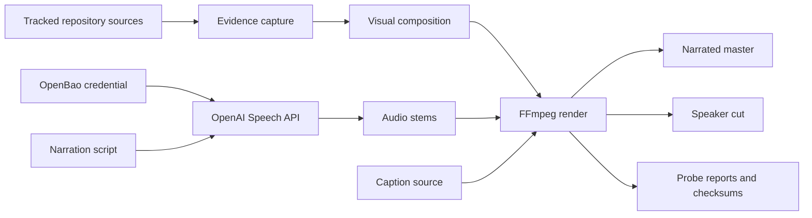
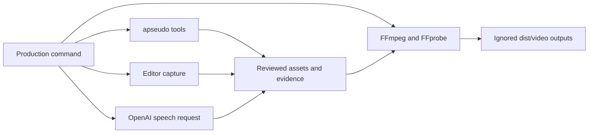
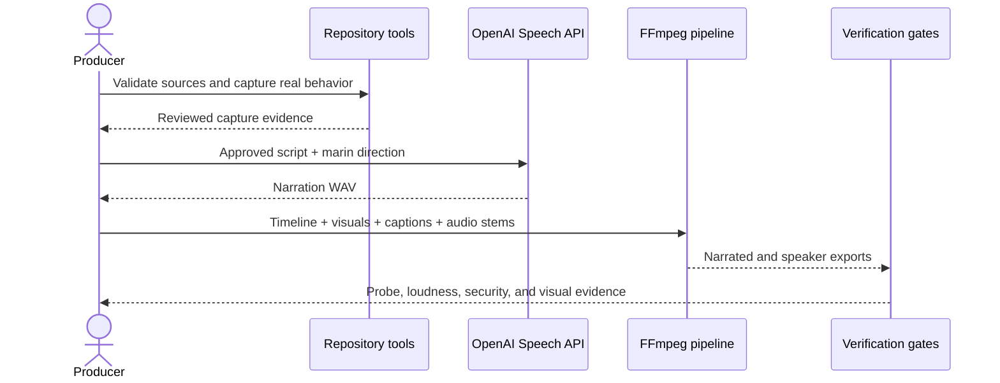
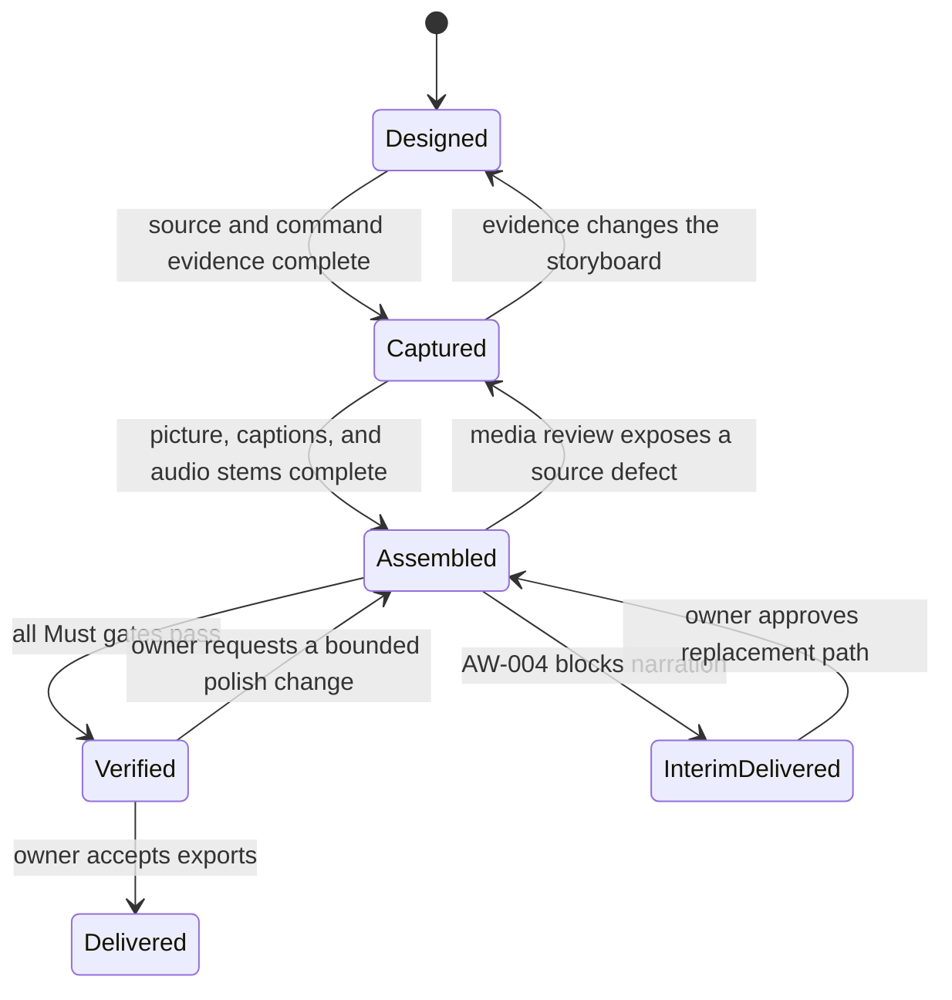

# `Repository Explainer Video` — Specification (Standard)

---

## Revision History

| Version | Date | Author | Change |
| --- | --- | --- | --- |
| 0.5 | `2026-07-24` | Chris Purcell, Codex | Recalibrated the release as a quick repository demo and deferred release-grade media assurance. |
| 0.4 | `2026-07-23` | Codex, owner-authorized | Clarified provider permission granularity, fixed-frame narration fit, and production-code gate scope during requested Opus convergence. |
| 0.3 | `2026-07-23` | Codex | Resolved adversarial-review findings for reproducibility, per-variant delivery, provider fallback, provenance, and repository gates. |
| 0.2 | `2026-07-23` | Chris Purcell | Approved for implementation; confirmed OpenAI `marin` narration. |
| 0.1 | `2026-07-23` | Chris Purcell | Initial draft from the approved video design. |

**Spec lifecycle:** This document is **living until `approved`**, then **change-controlled**: post-approval edits require a new revision row and, for scope-affecting changes, re-approval by the owner. The owner's `2026-07-23` instruction to have Opus adversarially review the plan to convergence, followed by an explicit `continue`, authorizes revisions 0.3–0.4 insofar as they preserve the approved creative scope while making its production and acceptance contracts executable. Implementation deviations belong in the [Deviations Log](#deviations-log), not in silent requirement changes.

---

## 1. Purpose & Background

Pythonic Agent Pseudocode turns agent instructions into Python-shaped process definitions that people can inspect and tools can validate. The repository already contains the language convention, editor integrations, formatter, linter, language server, MCP server, hooks, CI integration, visualization tools, and executable runner. A developer evaluating the project from prose alone must still assemble those surfaces into one mental model.

This project will produce a conference-ready explainer film that demonstrates the toolkit through real repository artifacts and captured tool behavior. The film's central promise is:

> Agent behavior can be understandable enough to read and concrete enough to run.

### 1.1 Quick-demo release boundary

The owner recalibrated this work on `2026-07-24`: this is a polished quick repository demo, not a release-grade media assurance system. The first local delivery is accepted when it has:

- real repository, editor, and CLI footage with no fabricated success claim;
- `marin` narration plus a same-picture speaker cut;
- burned-in narrated captions, mute-safe scene copy, and AI-narration disclosure;
- basic FFprobe and loudness checks for both MP4s;
- stable filenames, a delivery inventory, and SHA-256 checksums; and
- one documented rerender command using the selected narration WAV.

The first local delivery does **not** require hermetic reproduction, bit-for-bit or decoded-stream equivalence, adversarial promotion gates, per-glyph pixel forensics, exhaustive runtime dependency provenance, denial probes against unrelated provider APIs, or remediation of unrelated repository-wide gates. Existing implementation that supports those concerns may remain, but it is not a delivery blocker and must not delay the demo. Where later acceptance language conflicts with this boundary, this section controls the quick-demo release.

The first release is optimized for a technical presentation. It must support a live speaker and also stand alone with calm narration and captions. The durable value is a reproducible media pipeline: future repository changes can replace captures, narration, or individual scenes without rebuilding the film from an opaque editing project.

---

## 2. Scope

### 2.1 In Scope

- A 1920×1080, 30 fps explainer film targeting 2 minutes 15 seconds.
- A six-scene narrative: ambiguity, readable workflow, caught defect, shared policy, guarded execution, and closing promise.
- Real editor and terminal interaction drawn from this repository.
- Brief motion-graphic system maps that explain how the shared policy core serves editors, agents, hooks, and CI.
- Calm neural narration using OpenAI `gpt-4o-mini-tts` with the `marin` voice.
- Burned-in English captions on the narrated master, mute-safe on-screen copy on both variants, and a reusable caption source file.
- A narrated master and a live-speaker cut without narration.
- Reusable source assets, capture evidence, audio stems, and a deterministic FFmpeg render recipe.
- Media and repository validation sufficient to prove that displayed behavior is genuine and the exports are technically sound.

### 2.2 Out of Scope (Non-Goals — never)

| ID | Non-Goal | Reason |
| --- | --- | --- |
| NG-001 | Presenting fabricated terminal output or a synthetic successful runner result as real | Credibility is the film's central value; illustrative output must be visibly labeled rather than passed off as evidence. |
| NG-002 | Explaining every command or integration in the toolkit | A comprehensive tutorial would exceed conference pacing and obscure the core message. |
| NG-003 | Tracking credential values, provider invoices, account identifiers, or itemized billing data in the repository | OpenBao and the provider account remain the systems of record; the repository stores references and a non-itemized pass/fail spend bound only. |
| NG-004 | Building a general-purpose video editing framework | The production source may be reusable, but it exists to render this film rather than become a standalone product. |
| NG-005 | Using voice cloning or imitating a real person | A built-in disclosed synthetic voice is sufficient and avoids consent and likeness concerns. |

### 2.3 Won't Have in v1 (deferred — not never)

| ID | Deferred Capability | Why Deferred | Revisit When |
| --- | --- | --- | --- |
| WH-001 | Alternate aspect ratios such as vertical or square | The approved venue is a conference presentation, where 16:9 is the useful master. | A social or mobile distribution channel is selected. |
| WH-002 | Translated narration and captions | The target audience and approved script language are English. | A named event or audience requires another language. |
| WH-003 | A tracked binary MP4 in Git | Large generated binaries add repository weight and do not improve reproducibility. | The project adopts Git LFS or a release-asset publication workflow. |
| WH-004 | A human-recorded narration take | The approved first version uses the `marin` neural voice. | A speaker or voice actor supplies a recorded replacement stem. |

### 2.4 Boundaries

| Boundary | Description |
| --- | --- |
| System owns | Storyboard, script, capture manifest, visual assets, captions, audio stems, render recipe, QA evidence, and the generated video exports. |
| System depends on | Existing repository examples and CLIs, VS Code or an equivalent truthful editor capture, FFmpeg/FFprobe, Noto Sans fonts, OpenAI's Speech API, OpenBao, and the Codex runner backend for one bounded demonstration. |
| System does not own | Pythonic Agent Pseudocode semantics, APSEUDO rules, provider availability, conference playback hardware, OpenAI account policy, or long-term binary hosting. |

---

## 3. Context

### 3.1 Current State

The repository is on `main` and contains a working prototype at version 0.6.1. Its public story is distributed across `README.md`, `docs/usage.md`, feature guides, examples, test fixtures, and runner documentation. The strongest existing source artifacts for the film are:

- `docs/apseudo-docs/examples/review-loop.apseudo`, a readable bounded loop;
- `tests/fixtures/invalid/unbounded_while.apseudo`, a deliberate violation;
- `docs/apseudo-docs/examples/runner/review-spec.apseudo`, a read-only executable task;
- `docs/reference/RULES.md`, a hand-maintained derived rule catalog that may drift from `src/apseudo_lint/rules.py` and is not authoritative;
- `docs/usage.md`, the CLI contract.

FFmpeg, FFprobe, VS Code, Noto Sans, and Noto Sans Mono are available on the reference workstation. OpenBao contains a project TTS credential reference. The browser brainstorming artifacts are exploratory only; no durable production assets or final video exist yet.

The repository's general Python gate currently fails on its pre-existing 62% coverage result against an 85% floor. The media package may reach local Verified state with scoped video evidence, but the implementation must still run and report every repository gate and may not claim repository completion while that gate remains red; DEV-001 records the pre-existing blocker without expanding this film into unrelated coverage remediation.

### 3.2 Target State

The repository contains a small, understandable source tree for the film and a single documented render entry point. Running the approved production flow recreates:

1. a narrated master with captions;
2. a same-picture speaker cut with a low-level tonal bed, cues, mute-safe scene copy, and no narration transcript;
3. caption and selected narration-stem files in the local delivery bundle;
4. a machine-readable capture/verification record;
5. checksums for delivered artifacts.

Every terminal line presented as real traces to a captured command. Every displayed valid workflow passes the repository formatter and linter. The intentionally invalid workflow is clearly identified as a teaching state.

### 3.3 Assumptions

| ID | Assumption | Impact if False |
| --- | --- | --- |
| A-001 | Production source will live under `media/repository-explainer/`, while generated exports will live under ignored `dist/video/`; any Python production package there will be added to the repository's pytest import/test, Ruff, BasedPyright strict, and targeted coverage scopes through `pyproject.toml`. | Only paths and render/static-analysis configuration change; the narrative and media contract remain intact. |
| A-002 | The conference player accepts an H.264 video stream with AAC stereo audio in an MP4 container. | Add a venue-specific transcode without changing the master timeline. |
| A-003 | English captions and narration are sufficient for the first venue. | WH-002 must be reopened and the timeline may need adjustment for translated speech length. |
| A-004 | A truthful read-only runner demonstration can complete in a disposable Git workspace. | The scene stops at verified preflight and command rendering; it must not display a fabricated `Accepted` outcome. |
| A-005 | OpenAI continues to offer `gpt-4o-mini-tts`, voice `marin`, and WAV output as verified against the official API documentation on `2026-07-23`; the project-key dashboard continues to offer a Restricted permission that permits Speech requests and may bundle Speech with other model capabilities. | The narrated master blocks; AW-004 governs interim delivery and the owner must approve any substitute voice, model, human recording, or broader-than-available permission exception. |

### 3.4 Constraints

| ID | Constraint | Source |
| --- | --- | --- |
| C-001 | The film shall work for developers evaluating the toolkit during a conference presentation. | Owner-approved design. |
| C-002 | The narrative shall combine the ideas “readable and executable” and “complex behavior made understandable.” | Owner-approved design. |
| C-003 | Between 60% and 80% of timeline frames shall present real tracked source or captured tool output as the dominant visual; a hybrid frame counts as real interaction when that evidence occupies at least half of the frame area. | Owner-approved 70/30 hybrid target with an acceptance tolerance. |
| C-004 | Narration shall use `gpt-4o-mini-tts` with voice `marin` and a calm, precise technical style; no substitute may be used without owner approval under AW-004. | Owner decision and OpenAI Speech API contract. |
| C-005 | Source and output must never contain credential values. | Repository credential policy. |
| C-006 | Displayed pseudocode shall use repository tooling and remain free of blocking APSEUDO diagnostics except for the explicitly labeled invalid teaching example. | `AGENTS.md` and the `agent-pseudocode` skill. |
| C-007 | TTS generation shall remain below USD 1 for this deliverable unless the owner approves additional spend. | Cost-control decision derived from the selected provider's token pricing. |
| C-008 | The film shall disclose that its narration is AI-generated. | OpenAI Text-to-Speech usage policy. |
| C-009 | New production Python shall be covered by pytest, Ruff, BasedPyright strict, and targeted coverage commands even though it remains outside the distributed `apseudo_lint` wheel. | Repository Python-tooling policy and DEV-001 scope boundary. |

---

## 4. Goals

| ID | Goal | Success Signal | Achieved By |
| --- | --- | --- | --- |
| G-001 | Make the repository's central value understandable to an evaluating developer. | A viewer can state that agent behavior is readable, verifiable, and executable after one viewing. | FR-001, FR-002, FR-003 |
| G-002 | Demonstrate that the toolkit is real rather than conceptual. | Every claimed tool interaction traces to captured repository behavior. | FR-004, FR-005, NFR-006 |
| G-003 | Deliver a conference-ready asset usable with or without a live speaker. | Both exports pass media checks and remain comprehensible when muted. | FR-006, FR-007, FR-008, NFR-003 |
| G-004 | Make future revisions bounded and reproducible. | A clean checkout plus the checksummed selected narration stem can replace one scene and reproduce both exports without another provider call. | FR-009, DR-001, DR-002, NFR-005 |

---

> **§5 (Stakeholders and Users) is Full-tier** and is intentionally omitted at the Standard profile.

## 6. Glossary

| Term | Definition | Notes / Not to be confused with |
| --- | --- | --- |
| Capture evidence | Stored command, source revision, output, and status that support an on-screen interaction. | Not a hand-authored terminal mockup. |
| Narrated master | The H.264/AAC MP4 containing narration, the procedural tonal bed/cues, and burned-in narration captions. | Distinct from the speaker cut. |
| Speaker cut | The same visual timeline without narration, retaining concise on-screen copy and the non-speech audio bed. | Intended to support a live presenter. |
| Teaching example | A deliberately invalid workflow shown so a diagnostic can correct it. | Must be labeled; it is not accepted source. |
| Truthful composite | A designed crop, zoom, or reconstruction whose source text and output come from real artifacts. | Layout may be polished; semantic content may not be altered. |
| Title-safe area | The central frame region kept clear of projector and presentation-player cropping. | Applied to code, captions, and essential labels. |

---

## 7. Requirements

### 7.1 Functional Requirements

| ID | Requirement | Rationale | Acceptance Criteria | Priority |
| --- | --- | --- | --- | --- |
| FR-001 | The film shall communicate that agent behavior can be read, understood, validated, and run. | This is the approved product promise. | The opening problem, workflow reveal, validation, execution, and end card form one coherent claim without requiring narration. | Must |
| FR-002 | The timeline shall use the approved six-scene narrative in the approved order. | The progression moves from developer pain to evidence and recall. | Scene markers and final render follow §10.1 with no missing stage. | Must |
| FR-003 | The film shall feature `docs/apseudo-docs/examples/review-loop.apseudo` as its recurring visual subject. | A product-tracked example is a stronger authenticity claim than a film-specific substitute. | Every recurring workflow view maps to that exact path and the file passes the repository formatter and linter at the capture revision. | Must |
| FR-004 | Every interaction presented as real shall be generated from a recorded command or source capture at a named Git revision. | The film must earn developer trust. | The capture manifest maps each such scene to source, command, exit status, and stored output; displayed rule text comes from captured `apseudo-explain` output or is verified byte-equal to `src/apseudo_lint/rules.py` at that revision. | Must |
| FR-005 | The runner scene shall show successful execution only when a real Codex run in a disposable clone passes `--check`, `--render-prompt`, `--print-command`, `--sandbox read-only`, `--require-no-diff`, hooks, and deterministic post-checks. | A fake or weakly contained success result would contradict NG-001. | The displayed result matches the preserved resolved argument vector and run record; otherwise the scene ends at verified preflight under AW-003. | Must |
| FR-006 | The pipeline shall produce a narrated master using `marin`; narration segments shall fit the fixed scene budgets, and if A-005 becomes false no substitute is permitted without owner approval. | The owner selected a calm technical neural voice and a fixed 4050-frame picture. | Each selected segment begins at least 15 frames after its scene start and ends at least 15 frames before its scene end; an overlong take is rejected and the owner-approved line is shortened without moving picture boundaries, or the narrated deliverable remains blocked under AW-004. | Must |
| FR-007 | The pipeline shall produce a speaker cut without narration on the same 4050-frame visual timeline. | The same film must support a live presenter without timing drift. | The speaker MP4 has the same video-frame count as the narrated master, contains no speech track or narration transcript, and retains mute-safe scene copy plus the lower-level non-speech bed. | Must |
| FR-008 | The narrated master shall include burned-in English narration captions and both variants shall retain mute-safe on-screen scene copy. | Standalone muted playback and live-speaker use have different text needs. | Narrated copy is represented accurately in the reusable caption source and burned into the narrated master; the speaker cut omits narration transcription but its scene copy still communicates all six stages and the closing promise. | Must |
| FR-009 | The production source shall support deterministic replacement and rerendering of individual captures, graphics, or audio stems. | The repository will evolve after this release. | A documented render command rebuilds the speaker cut from a clean checkout and rebuilds the narrated master from that checkout plus the checksummed selected narration WAV, without another provider call or manual timeline editing. | Must |
| FR-010 | The film shall disclose its AI-generated narration. | Provider policy requires clear disclosure. | The disclosure appears on the end card and in the checksummed `delivery.json` sidecar. | Must |
| FR-011 | The production shall include a procedurally generated non-speech tonal bed and cues. | The speaker cut needs restrained continuity audio without introducing third-party music rights. | The render manifest records the FFmpeg synthesis parameters and proves that no external music asset entered either mix. | Must |

### 7.2 Non-Functional Requirements

| ID | Category | Requirement | Measurement / Acceptance Criteria | Priority |
| --- | --- | --- | --- | --- |
| NFR-001 | Format | Both variants shall be 1920×1080 at 30 progressive frames per second. | FFprobe reports `1920x1080`, 30 fps, H.264 video, AAC stereo audio, and an MP4 container for each variant. | Must |
| NFR-002 | Duration | Both variants shall share exactly 4050 video frames and the same 135-second program duration. | FFprobe reports 4050 frames for each variant; container, video, and audio durations equal 135 seconds within one frame; no audio packet or narration segment extends past frame 4050 or outside its FR-006 scene budget. | Must |
| NFR-003 | Accessibility | Essential meaning shall remain available without audio in each variant. | A muted review of the narrated master using captions and of the speaker cut using scene copy can identify all six scenes and the closing promise. | Must |
| NFR-004 | Legibility | Essential code, command, caption, and label text shall remain readable from a conference screen. | A representative full-resolution frame review confirms readable type, useful contrast, and title-safe placement in all six scenes. Automated per-glyph pixel analysis is deferred. | Must |
| NFR-005 | Reproducibility | The reviewed source and selected narration WAV shall support a practical rerender. | One documented command rebuilds both variants without another Speech API call. Hermetic or decoded-stream equivalence is deferred. | Must |
| NFR-006 | Authenticity | Designed composites shall not change the semantic content of captured source or output. | A side-by-side evidence review finds no altered command, diagnostic, rule code, outcome, or source statement. | Must |
| NFR-007 | Audio quality | Narration shall be clear while the live-speaker bed remains unobtrusive. | The narrated mix measures −16 LUFS integrated (±1 LU) with true peak no higher than −1 dBTP; the speaker cut measures −28 LUFS integrated (±2 LU) with true peak no higher than −6 dBTP; playback spot checks confirm speech intelligibility and live-speaker headroom. | Must |
| NFR-008 | Security | Production logs and source shall contain no credential value. | The production process passes the key only through its environment; a targeted source/log scan and reviewed Git diff contain references only. Media OCR, transcription, and entropy forensics are deferred. | Must |
| NFR-009 | Cost | Bounded TTS generation shall remain within C-007. | A non-itemized verification record contains take count, derived usage estimate, the approved cap, and pass/fail only; it contains no invoice, account identifier, payment data, or provider billing export. | Should |
| NFR-010 | Asset rights | The demo shall use repository material, declared Noto fonts, generated SVGs, and procedural audio only. | The delivery record names those input classes and no third-party music or stock imagery is used. Exhaustive runtime dependency provenance is deferred. | Must |

### 7.3 Interface Requirements

| ID | Interface | Requirement | Contract / Format | Acceptance Criteria |
| --- | --- | --- | --- | --- |
| IR-001 | Repository source | The capture stage shall read tracked examples, docs, and CLI output without modifying product behavior. | Git paths named in §3.1 and production-specific media sources. | Product-source diff remains empty after capture except for intentional media-source work. |
| IR-002 | OpenAI Speech API | The narration stage shall call only the speech-generation endpoint with the approved model, voice, input, and instructions. | `POST /v1/audio/speech`; WAV response; the narrowest available Restricted permission that permits Speech, with every separately configurable management, files, fine-tuning, assistants, and administration permission set to None. | Before paid takes, a dated documentation/dashboard record names the exact permission groups available and selected; a restricted-key smoke request confirms Speech succeeds and each separately denied non-model resource class is refused. The evidence does not claim that bundled model capabilities are independently denied. |
| IR-003 | FFmpeg/FFprobe | The render stage shall create and inspect the delivery artifacts through command-line interfaces. | H.264/AAC MP4, WAV stems, SRT captions, JSON or text probe reports. | Render and probe commands exit zero and match NFR-001, NFR-002, and NFR-007. |
| IR-004 | Runner | The execution scene shall use `apseudo-run` preflight surfaces before a bounded Codex invocation in a disposable clone. | `--agent codex`, `--check`, `--render-prompt`, `--print-command`, `--sandbox read-only`, `--require-no-diff`, and `--run-dir dist/video/work/runner-runs`. | Preflights pass and the preserved resolved argument vector, hooks, run record, changed-file report, and no-diff postcondition prove the displayed result. |
| IR-005 | Delivery files | The production flow shall emit stable, descriptive filenames. | `agent-pseudocode-explainer-narrated.mp4`, `agent-pseudocode-explainer-speaker.mp4`, selected narration WAV, caption source/SRT, `delivery.json`, asset provenance, verification reports, and checksums. | Every required deliverable exists, the disclosure is present in `delivery.json`, and every file checksum is recorded. |

### 7.4 Data Requirements

| ID | Data Entity | Requirement | Validation Rules | Ownership |
| --- | --- | --- | --- | --- |
| DR-001 | Capture manifest | The pipeline shall retain provenance for every real interaction used in the film. | Records Git revision, source path, exact argv, exit status, output path, and capture timestamp; never stores environment values. | Repository media source |
| DR-002 | Narration package | The pipeline shall retain the approved narration text, direction, voice identifier, captions, and selected WAV. | Text and captions agree; voice is `marin`; WAV passes probe and loudness checks; the selected WAV is checksummed and retained as an untracked local delivery input required for narrated reproduction. | Repository text source plus local delivery bundle |
| DR-003 | Render manifest | The pipeline shall record scene order, timing, asset checksums, and export checksums. | All references resolve; durations fit the timeline; checksums match delivered files. | Repository media source and delivery bundle |
| DR-004 | Temporary run data | The pipeline shall isolate transient TTS responses, disposable runner clones/records, and render intermediates below `dist/video/work/`. | Every transient path resolves below the already ignored root, including `dist/video/work/runner-runs`; final evidence is copied selectively after review and no `.apseudo/runs` path is used. | Local production workspace |
| DR-005 | Asset provenance | The pipeline shall retain provenance for fonts, graphics, and audio inputs. | Records repository path or external source, license identifier or procedural-generation method, and checksum. | Repository media source and delivery bundle |

---

## 8. Architecture and Design

### 8.1 Architecture Summary

The production pipeline has five stages: source selection, evidence capture, visual composition, narration/audio, and final rendering. Source selection binds every scene to tracked repository artifacts. Evidence capture executes the actual formatter, linter, rule explanation, Mermaid, and runner preflight surfaces and records their outputs. Visual composition turns those sources into large-screen editor and terminal scenes without changing semantic content. Narration uses one OpenAI Speech API call path with an OpenBao-sourced key and a replaceable, checksummed WAV delivery input. FFmpeg assembles the visual timeline, captions, narration, procedurally generated tonal bed, and cues into the two exports.

Trust boundaries are explicit. OpenBao owns the credential value. The OpenAI request receives only the narration script and delivery instructions. The runner executes only in a disposable Git workspace under read-only/no-diff controls. Generated outputs do not become evidence until their source and status have been reviewed.

### 8.2 Architecture Views

#### 8.2.1 Context View

#### 8.2.2 Container / Deployment View

This project has no deployed service. It runs as a bounded production job on the workstation:

#### 8.2.3 Component View

| Component | Responsibility | Interfaces | Notes |
| --- | --- | --- | --- |
| Source ledger | Maps scenes to repository evidence and commands. | Git, files, capture manifest | Authoritative for authenticity review. |
| Capture stage | Runs and records real tool behavior. | `apseudo-*`, VS Code, runner | Must not mutate product behavior. |
| Visual stage | Produces editor macros, terminal frames, system maps, captions, and transitions. | Source/capture assets to frame sequences | May crop or animate, never rewrite evidence. |
| Narration stage | Generates, normalizes, and retains the selected `marin` voice track as a checksummed local delivery input. | OpenBao environment to OpenAI Speech API to WAV | Paid and retry-bounded; reproduction never recalls the provider. |
| Render stage | Assembles scenes and audio into delivery files. | FFmpeg | Produces narrated and speaker cuts from one timeline. |
| QA stage | Validates pseudocode, evidence, security, media streams, loudness, captions, and representative frames. | Repository tools, scans, FFprobe, manual review | Blocks delivery on a Must failure. |

### 8.3 Design Decisions

| ID | Decision | Rationale | Alternatives Considered | ADR |
| --- | --- | --- | --- | --- |
| D-001 | Use an editor-first hybrid film: approximately 70% real interaction and 30% system-map motion graphics. | Developers need proof and architecture; either mode alone loses one of those. | Pure screen documentary (too flat for a large room); full motion graphics (too conceptual). | — |
| D-002 | Use a six-scene, 2:15 narrative ending with “Behavior you can read. Work you can run.” | The arc makes one memorable promise and keeps conference pacing bounded. | Feature catalog (rejected as diffuse); tutorial (rejected as too long). | — |
| D-003 | Use Noto Sans and Noto Sans Mono over an ink/blue/mint/coral palette. | The fonts are present, readable, open, and suited to source code; colors encode structure, success, and diagnostics. | Decorative or brand-heavy treatment (rejected as less credible for developers). | — |
| D-004 | Use OpenAI `gpt-4o-mini-tts` voice `marin` with a calm technical direction; require owner approval before any substitute under AW-004. | The owner selected it after comparing neural-voice quality and cost. | Local eSpeak-NG (less natural); ElevenLabs or another built-in voice (not pre-approved). | — |
| D-005 | Produce both narrated and speaker cuts from one visual timeline. | This satisfies standalone and live-presentation use without divergent edits. | One narrated file only (poor live-speaker fit); separate edits (drift risk). | — |
| D-006 | Keep generated MP4s and the selected WAV under ignored `dist/video/`, retain them together in the local checksummed delivery bundle, and keep all deterministic source in Git. | Generated binaries are large; repeatable source plus a retained selected stem avoids both repository growth and nondeterministic paid regeneration. | Commit binaries directly (repository growth); regenerate speech on every render (cost and timing drift); opaque external editor project (poor reproducibility). | — |

> **§8.4 (Detailed Data Flow) is Full-tier** and is intentionally omitted at the Standard profile.

### 8.5 Design Constraints

- A real interaction may be cropped, zoomed, color-corrected, or re-timed, but its semantic content must remain unchanged.
- A runner success may appear only after a real Codex execution in a disposable clone with `--sandbox read-only`, hooks, and a no-diff postcondition.
- The invalid teaching example must never be confused with accepted source.
- Narration, captions, and scene timing must derive from one approved script.
- A single timeline definition must drive both final exports.
- OpenBao and environment variables are the only credential handoff boundary.
- No render step may echo its process environment or authorization headers.
- Mermaid and motion graphics explain relationships; they are not presented as the language's source of truth.

---

## 9. Data Model

The project owns no database. Durable source is a set of versioned text, graphics, and manifests keyed by stable scene IDs. Each scene record includes an ID, start/end time, visual source, evidence record where applicable, caption intervals, and audio cues. Asset paths are repository-relative; generated artifacts carry SHA-256 checksums.

Transient media, provider responses, disposable runner clones/logs, and render intermediates live only below ignored `dist/video/work/` until reviewed. The final evidence subset is promoted by explicit file selection rather than copying an entire run directory. The selected narration WAV remains untracked but is promoted into the checksummed delivery bundle as an input to future narrated reproduction.

---

## 10. Behavior and Workflows

### 10.1 Primary Workflow

The approved timeline is:

1. **00:00–00:15 — The problem.** Dense prose asks, “What will the agent actually do?”
2. **00:15–00:35 — Make it visible.** A Python-shaped workflow becomes the recurring visual subject.
3. **00:35–01:00 — Catch ambiguity.** An unbounded loop receives an `APSEUDO-WHILE-001` diagnostic and becomes bounded.
4. **01:00–01:25 — One shared truth.** A short system map shows the shared core feeding editor, MCP, runner, hooks, pre-commit, and CI.
5. **01:25–01:55 — Run with guardrails.** Runner preflight leads to a real bounded read-only outcome when A-004 holds.
6. **01:55–02:15 — The promise.** The film closes on “Behavior you can read. Work you can run,” the repository name, and the AI-narration disclosure.

Expected result: both export variants pass §17 and tell the same story.

### 10.2 Alternate Workflows

| ID | Trigger | Behavior | Expected Result |
| --- | --- | --- | --- |
| AW-001 | The live speaker does not want recorded narration. | Use the speaker cut while retaining mute-safe scene copy and the low-level procedural tonal bed/cues, but no narration transcript. | The six-scene story remains understandable without competing with the presenter. |
| AW-002 | A narration line changes after picture lock. | Regenerate only the affected TTS segment and re-time its captions within the unchanged scene boundary. | The master changes without rebuilding unrelated captures. |
| AW-003 | The real runner result is not `Accepted`. | Use verified preflight and explain the guarded launch boundary without displaying a success outcome. | The scene remains truthful and the closing claim is limited to executability rather than a fabricated result. |
| AW-004 | The approved model, `marin`, WAV response, credential permission, or provider availability blocks narration after bounded attempts. | Stop Speech calls, preserve the verified speaker cut as an interim delivery, and request owner approval for a substitute built-in voice/model or promotion of WH-004. | No narrated master or substitute is represented as approved; v1 remains incomplete until the owner accepts a replacement path and the narrated Must gates pass. |

### 10.3 Edge Cases

| ID | Edge Case | Expected Behavior |
| --- | --- | --- |
| EC-001 | A command or diagnostic changes before capture. | Update the storyboard copy to the current truth or pin the capture to its named revision; never combine mismatched versions. |
| EC-002 | Source lines exceed the conference-safe frame width. | Reframe into multiple truthful macro shots rather than shrinking below NFR-004. |
| EC-003 | Captions exceed two lines or obscure essential code. | Shorten display copy without changing meaning and re-time captions; narration script remains the source. |
| EC-004 | The TTS provider returns an unsuitable pronunciation of a project term. | Adjust punctuation or delivery instructions and regenerate within the bounded retry policy. |
| EC-005 | An output scan matches a benign high-entropy checksum. | Review and allowlist that artifact type locally; do not weaken scans over logs or source. |
| EC-006 | A selected narration take exceeds its fixed scene budget or leaves less than 15 frames of head/tail margin. | Reject the take, shorten and owner-approve the affected line without changing meaning, regenerate only that segment within C-007, and keep picture/caption scene boundaries fixed. |

### 10.4 State Transitions

| State | Meaning | Entry Condition | Exit Condition |
| --- | --- | --- | --- |
| Designed | Approved narrative and production contract exist. | This specification is review-ready. | Capture evidence is complete. |
| Captured | Required real interactions and source assets are preserved. | FR-004 evidence is complete. | Timeline and audio are assembled. |
| Assembled | Both candidate exports exist. | All scenes and stems render. | QA passes or returns a precise defect. |
| InterimDelivered | The verified speaker cut is available, but the narrated Must deliverable is blocked under AW-004. | Owner accepts a clearly labeled interim package. | Owner approves a replacement narration path and production returns to Assembled. |
| Verified | Candidate exports satisfy every Must gate. | §17 checks pass. | Owner accepts delivery or requests bounded polish. |
| Delivered | Final artifacts and source handoff are complete. | Owner acceptance. | Terminal state for v1. |

---

## 11. UI Pages / API Endpoints

Not applicable: the deliverable exposes no shipped UI or API; build-time interfaces are specified in §7.3.

---

## 12. Error Handling and Recovery

### 12.1 Expected Failures

| ID | Failure Mode | User/System Behavior | Logging / Observability | Recovery |
| --- | --- | --- | --- | --- |
| ERR-001 | A displayed valid workflow fails formatting or linting. | Rendering stops before export. | Formatter/linter output names the file and APSEUDO code. | Correct the production source, explain the rule when needed, and rerun both checks. |
| ERR-002 | Runner preflight or execution fails. | The film does not show a successful outcome. | Preserve preflight output and the normalized run record without environment values. | Repair the bounded demo or use AW-003. |
| ERR-003 | OpenAI rejects, times out, withdraws the approved combination, or returns unsuitable or over-budget-duration narration. | The failed take is excluded from the timeline and no substitute is selected automatically. | Record failure class, take number, measured frame duration, and scene budget, not headers or key material. | Retry at most three total takes; use EC-006 for duration overrun, stop for configuration/auth failures, and follow AW-004 when the narrated deliverable remains blocked. |
| ERR-004 | FFmpeg or FFprobe fails. | No candidate is promoted to Verified. | Preserve command, exit status, stderr, and the affected artifact path. | Correct the asset or render configuration and rebuild from the last reviewed inputs. |
| ERR-005 | A secret scan reports a material finding. | Delivery stops and affected artifacts are quarantined locally. | Record the file path and finding class without copying the matched value. | Remove the leaked artifact, rotate if exposure is plausible, regenerate, and rerun the scan. |
| ERR-006 | Captions drift or obscure essential content. | Candidate fails accessibility review. | Caption QC notes identify time interval and defect. | Retiming or copy correction followed by a full muted review. |

### 12.2 Retry and Idempotency

- TTS transport or provider failures may be retried, but the approved script, model, voice, and instructions remain fixed per take series. At most three total takes are generated without owner approval.
- Authentication, permission, billing, policy, and malformed-request failures are configuration failures and are not retry-looped.
- Capture and render commands may be rerun because outputs are written to explicit scene/take paths and final filenames are promoted only after QA.
- A content hash over script, voice, instructions, source revision, and selected narration WAV identifies each narrated render input set.
- Runner provider retries use the runner's bounded option and remain read-only; they may not bypass hooks, post-checks, or diff policy.

### 12.3 Rollback / Recovery

Generated artifacts are replaceable. A failed or disliked render is recovered by retaining the last Verified output, reverting only the affected source asset or timeline change, and rendering a new candidate with a new manifest. No database or remote state must be rolled back. If a credential may have entered an artifact or process output, stop production, delete the affected local artifacts, rotate the key in OpenBao, and rerun from reviewed source.

---

## 13. Security and Privacy

### 13.1 Authentication

The narration process authenticates to OpenAI with a project-scoped, user-owned API key resolved from OpenBao at runtime. The key uses the narrowest available Restricted scope that permits Speech requests; every separately configurable management, files, fine-tuning, assistants, and administration permission is None. If the provider bundles Speech with other model capabilities, the production process still calls only `/v1/audio/speech`, the exact bundle is recorded, and no narrower containment is claimed. The runner demonstration uses the workstation's existing Codex authentication and executes in a disposable clone with `--sandbox read-only` plus the no-diff postcondition.

### 13.2 Authorization

| Actor / Role | Allowed Actions | Denied Actions |
| --- | --- | --- |
| Owner | Approve script, media, external spend, and final delivery. | No restriction within the owner's accounts, subject to repository policy. |
| Production process | Read approved repository sources, request speech, write ignored local media, and run bounded validation/capture commands. | Reading unrelated secrets, changing product behavior for visual convenience, publishing artifacts, or broad API use. |
| Runner demonstration | Read the disposable clone through Codex `--sandbox read-only` and return a normalized outcome. | Writing source, escaping the workspace, bypassing hooks/post-checks, or retaining unrelated context. |

### 13.3 Secrets

| Secret | Storage Location | Access Pattern | Rotation / Notes |
| --- | --- | --- | --- |
| `OPENAI_API_KEY` | OpenBao `secret/api-keys/ai/openai-tts` | Resolved into the narration process environment; sent only as the Speech API bearer credential. | Rotate in OpenBao after suspected exposure; source and docs retain references only. |

### 13.4 Sensitive Data

| Data | Classification | Storage | Transmission | Retention |
| --- | --- | --- | --- | --- |
| OpenAI API key | Restricted | OpenBao and process memory | Tailscale to OpenBao; TLS to OpenAI | Never retained in production assets or logs. |
| Narration script and generated voice | Public after release | Repository text plus untracked checksummed delivery WAV | TLS to/from OpenAI | Retained with the local delivery package so reproduction does not recall the provider. |
| Runner/capture logs | Internal before review | Ignored production workspace; reviewed subset may become source evidence | Local filesystem | Keep only the minimal evidence required to reproduce scenes. |

### 13.5 Threats and Mitigations

| Threat | Impact | Mitigation |
| --- | --- | --- |
| Credential leakage through shell tracing, environment dumps, or captured terminal footage | Unauthorized API use | No shell tracing, no environment capture, restricted key, secret scans, and manual evidence review. |
| Fabricated or stale tool output | Loss of developer trust | Capture manifest, revision pinning, command replay, and semantic comparison. |
| Runner modifies repository state | User work loss or misleading scene | Disposable clone, Codex `--sandbox read-only`, hooks, no-diff policy, post-checks, and run record. |
| Unlicensed music, fonts, or imagery | Distribution restriction | NFR-010 and DR-005 require open, procedural, or license-verified assets and retained provenance. |
| Prompt or source content sent unnecessarily to TTS | Unintended data disclosure | Send only the approved public narration script and delivery instructions. |

### 13.6 Hardening Checklist

- [x] Cookie/session settings: not applicable; no web session is shipped.
- [x] CSRF/CORS policy: not applicable; no browser API is shipped.
- [x] Webhook/API signature validation: not applicable; no webhook is consumed.
- [ ] Sensitive-data redaction in logs: required by NFR-008 and ERR-005.
- [ ] CI/CD secret handling: the render stays local and must never print or commit the key.
- [x] Network exposure: no listener or service is created.
- [x] Identity-header trust rules: not applicable; no authentication proxy is involved.
- [ ] Least privilege: the exact provider permission bundle is recorded, every separately configurable non-Speech resource is None, the process calls only `/v1/audio/speech`, and the runner sandbox matches §13.1–§13.3.

---

> **Sections §14 (Capacity and Scale Assumptions), §15 (Risks), and §16 (Compliance, Licensing, and Data Rights) are Full-tier** and are intentionally omitted at the Standard profile. This specification remains Standard because the paid API is a bounded build-time media input, not a shipped or recurring service. Cost, provider terms, disclosure, rights, retry, and credential controls are nevertheless explicit in C-007, C-008, FR-011, NFR-010, DR-005, §12, and §13.

## 17. Testing and Acceptance

### 17.1 Definition of Done

- [ ] All Must requirements are implemented and have Passing evidence in §17.3.
- [ ] The displayed valid pseudocode passes the formatter and linter; the teaching example remains explicitly labeled.
- [ ] Actual capture commands replay from the recorded Git revision.
- [ ] Both MP4 variants pass their explicit media, same-frame duration, stream, and per-variant loudness contracts; only the narrated master carries narration captions.
- [ ] Muted reviews prove the narrated captions and speaker-cut scene copy each communicate the six-scene story.
- [ ] Every scene/state transition and caption-bearing final frame passes the numeric text-size, central-90% title-safe, and contrast checks.
- [ ] Security scans and manual review find no credential value.
- [ ] AI narration disclosure is present on the end card and in `delivery.json`; NFR-010/DR-005 asset provenance passes.
- [ ] Reusable source, the checksummed selected narration WAV, captions, manifests, reports, checksums, and render instructions are delivered.
- [ ] Repository-required format, lint, type, test, coverage, audit, and structured-text gates have been run and reported exactly. A still-red pre-existing gate prevents a repository-complete claim even when the media package is locally Verified.
- [ ] Deviations and non-blocking open questions are accepted by the owner.

### 17.2 Test Strategy

| Layer | Scope | Required Coverage | Required? |
| --- | --- | --- | --- |
| Source validation | Displayed `.apseudo` sources and Markdown | Format check before lint; zero blockers outside the labeled teaching example. | Yes |
| Production Python | `media/repository-explainer/` package and `tests/video/` | Included in pytest import/test discovery, Ruff, BasedPyright strict, and targeted coverage configuration/commands. | Yes |
| Integration | OpenAI speech request and runner demonstration | Successful speech take; auth/permission failure handling; runner preflight and no-diff result. | Yes |
| Snapshot / contract | Capture and render manifests | Stable scene IDs, source/command provenance, timing, and checksums. | Yes |
| End-to-end | Full render | Speaker cut from a clean checkout; narrated master from that checkout plus the checksummed selected WAV; happy path plus one rejected-candidate path. | Yes |
| Security | Logs, source, intermediates, and exports | Secret-pattern scan and manual review of every promoted capture. | Yes |
| Media | Video, audio, and captions | FFprobe streams/duration, loudness analysis, caption timing, representative frame inspection. | Yes |
| Regression | Final approved package | Re-render from unchanged inputs and compare semantic manifests/checksums where deterministic. | Yes |

### 17.3 Requirement-to-Test Traceability

| Requirement ID | Test / Verification Method | Status |
| --- | --- | --- |
| FR-001 | Muted and narrated owner review against the approved promise. | Not Started |
| FR-002 | Timeline manifest contains the six ordered scene IDs and approved intervals. | Not Started |
| FR-003 | Formatter/linter output for `docs/apseudo-docs/examples/review-loop.apseudo` at the capture revision. | Not Started |
| FR-004 | Capture-manifest schema check plus manual evidence comparison. | Not Started |
| FR-005 | Preserved Codex argument vector, preflights, `--sandbox read-only`, hooks, run record, changed-file report, and no-diff postcondition from the disposable clone. | Not Started |
| FR-006 | Dated provider-contract evidence, per-segment frame-budget/margin validation, FFprobe of the narrated master, and TTS manifest confirming `marin`; AW-004 record if blocked. | Not Started |
| FR-007 | Same-frame-count comparison and speaker-cut audio inspection confirming no speech stem or narration transcript. | Not Started |
| FR-008 | Narrated caption parser/timing check plus separate muted reviews of narrated captions and speaker scene copy. | Not Started |
| FR-009 | Clean-checkout speaker render, narrated render with the selected WAV, no-network assertion, and bounded single-scene replacement rehearsal. | Not Started |
| FR-010 | End-card frame and checksummed `delivery.json` disclosure inspection. | Not Started |
| FR-011 | Render-manifest inspection proves the tonal bed/cues are procedurally synthesized and no external music input exists. | Not Started |
| NFR-001 | FFprobe stream report for both variants. | Not Started |
| NFR-002 | FFprobe proves 4050 frames and 135-second container/video/audio duration within one frame for both variants, with no audio packet past frame 4050. | Not Started |
| NFR-003 | Separate muted reviews of both variants. | Not Started |
| NFR-004 | Final-frame checks at every scene/state transition and caption-bearing state for 44 px captions, 32 px code, central-90% bounds, and WCAG relative-luminance contrast of at least 4.5:1. | Not Started |
| NFR-005 | Clean-checkout semantic comparison with the selected WAV supplied and a network-denial assertion. | Not Started |
| NFR-006 | Side-by-side source/capture review. | Not Started |
| NFR-007 | Separate FFmpeg EBU R128 analyses for the −16 LUFS narrated mix and −28 LUFS speaker bed plus playback spot checks. | Not Started |
| NFR-008 | Secret scan plus reviewed Git diff. | Not Started |
| NFR-009 | Non-itemized take-count/derived-estimate/cap/pass record contains no provider billing export or account identifier. | Not Started |
| NFR-010 | Asset-provenance validation blocks every unclassified font, graphic, or audio input. | Not Started |
| C-003 | Timeline/frame-area classifier reports 60%–80% real tracked source or captured tool output. | Not Started |
| C-009 | `pyproject.toml` and targeted commands prove pytest, Ruff, BasedPyright strict, and coverage include the non-wheel production package. | Not Started |
| IR-001 | Product-source diff review after capture. | Not Started |
| IR-002 | Dated dashboard record names the narrowest available permission bundle; Speech succeeds and each separately denied non-model resource class is refused. | Not Started |
| IR-003 | Render and probe command logs. | Not Started |
| IR-004 | Codex check/render/print-command/run evidence with exact containment flags and ignored run directory. | Not Started |
| IR-005 | Delivery file inventory, `delivery.json` disclosure, and SHA-256 manifest. | Not Started |
| DR-001 | Capture-manifest validation. | Not Started |
| DR-002 | Narration/caption consistency and audio probe. | Not Started |
| DR-003 | Render-manifest path/timing/checksum validation. | Not Started |
| DR-004 | Ignored-workspace and promotion-scope inspection. | Not Started |
| DR-005 | Asset-provenance manifest validation. | Not Started |

---

## 18. Deployment and Operations

### 18.1 Runtime Environment

| Item | Value |
| --- | --- |
| Runtime | Repository Python/Node tooling where needed; FFmpeg/FFprobe for media |
| OS / Platform | Reference Linux workstation |
| Datastore | None |
| External services | OpenAI Speech API; existing Codex runner backend |
| Scheduling | Manual bounded production run |
| Hosting | Generated files under local ignored `dist/video/`; publication is separate |

Runtime services: none. Health is the successful completion of source, render, probe, security, and manual acceptance gates.

### 18.2 Configuration

| Setting | Required? | Default | Description |
| --- | --- | --- | --- |
| `OPENAI_API_KEY` | Yes for narrated master | None | Restricted Speech API credential resolved from OpenBao. |
| TTS model | Yes | `gpt-4o-mini-tts` | Approved speech model. |
| TTS voice | Yes | `marin` | Approved narration voice. |
| Frame size | Yes | `1920x1080` | Conference master dimensions. |
| Frame rate | Yes | `30` | Progressive frames per second. |
| Output root | No | `dist/video/` | Ignored generated-delivery directory. |
| Work root | No | `dist/video/work/` | Ignored transient TTS, disposable runner, and render workspace. |
| Selected narration input | Yes for narrated reproduction | Delivery-bundle WAV | Checksummed approved stem; reproduction never recalls the Speech API. |

Environment matrix: none. The same local production flow creates all deliverables; there is no staging or deployed runtime.

### 18.3 Deployment Flow

1. Approve and lock the narration script and scene copy.
2. Validate production pseudocode and capture repository/tool evidence.
3. Generate and review visual assets.
4. Verify the dated provider/model/voice/WAV/permission contract, resolve the OpenAI key from OpenBao, and generate bounded `marin` takes.
5. Select and normalize the narration; finalize captions.
6. Render narrated and speaker candidates from one timeline.
7. Run source, security, media, loudness, caption, and checksum checks.
8. Perform narrated, muted, and representative-frame reviews.
9. Promote candidates, the selected narration WAV, `delivery.json`, provenance, reports, and captions to final filenames and record checksums.
10. Rollback by restoring the last Verified files and manifest; generated artifacts have no irreversible deployment state.

> **§18.4 (Rollout Controls) is Full-tier** and is intentionally omitted at the Standard profile.

### 18.5 Observability

This is a finite job rather than a service. Its observability surface is the capture manifest, per-stage exit status, render log, FFprobe reports, per-variant loudness analysis, security-scan result, frame-review checklist, asset-provenance manifest, non-itemized cost-bound record, `delivery.json`, and final checksum manifest. A stage failure blocks promotion and points to its source asset or command.

### 18.6 Backup and Disaster Recovery

The project owns no database. Committed deterministic source is protected by Git; the selected narration WAV is retained with the checksummed local delivery bundle because provider regeneration is not deterministic. Losing that bundle requires a new owner-approved take series and caption/timing verification rather than an ordinary reproduction.

### 18.7 Documentation Deliverables

- [ ] This specification remains the design and acceptance source.
- [ ] A concise render/readme document names prerequisites, the render command, outputs, and verification commands.
- [ ] The production manifest names source revision, scenes, assets, and checksums.
- [ ] `delivery.json` records the AI-narration disclosure and delivery inventory.
- [ ] The asset-provenance manifest records every non-repository input.
- [ ] Credential documentation contains references only.
- [ ] Handoff status is updated at implementation closeout.

---

## 19. Implementation Plan

This milestone ladder defines proof boundaries; a later implementation plan will break them into test-first tasks.

### MS-0 — Source and narrative lock

1. Establish the production source tree and ignored output/intermediate paths.
2. Write the final narration and caption source against the approved timeline.
3. Select exact repository examples and commands for every real interaction.
4. Define the capture and render manifest shapes.

### MS-1 — Evidence and visual assets

1. Validate all displayed pseudocode in the required formatter-then-linter order.
2. Capture real editor, diagnostic, Mermaid, runner-preflight, and runner evidence at a named revision.
3. Produce conference-safe editor/terminal macros and system-map graphics.
4. Pass authenticity and secret-exposure review before composition.

### MS-2 — Narration and assembly

1. Verify A-005, then generate bounded `marin` narration takes from the locked script.
2. Select, normalize, and stem the narration and background audio.
3. Assemble all scenes and captions into the shared timeline.
4. Render narrated and speaker candidates.

### MS-3 — Verification and delivery

1. Run the complete §17 gate.
2. Correct failed source, caption, audio, visual, or media checks and rerender.
3. Promote the accepted files, selected narration WAV, `delivery.json`, provenance, and verification reports; write checksums and preserve reusable sources.
4. Update repository handoff artifacts and deliver clickable output paths.

### Milestone Summary

| Milestone | Deliverable | Exit Criteria |
| --- | --- | --- |
| MS-0 Source and narrative lock | Approved source ledger, script, captions, and manifests | No placeholder or unresolved scene content remains. |
| MS-1 Evidence and visual assets | Reviewed truthful captures and graphics | FR-003–FR-005, NFR-006, and NFR-008 evidence passes. |
| MS-2 Narration and assembly | Both candidate exports | All six scenes render with selected audio and captions. |
| MS-3 Verification and delivery | Final package | Every Must row in §17.3 is Passing and owner accepts the outputs. |

---

> **§20 (Success Evaluation) is Full-tier** and is intentionally omitted at the Standard profile.

## 21. Open Questions and Decisions

| ID | Question | Current Assumption | Blocking? | Owner | Needed By | Status |
| --- | --- | --- | --- | --- | --- | --- |
| OQ-001 | Should the final MP4 later be published as a GitHub release asset or hosted elsewhere? | Deliver locally under ignored `dist/video/`; publication is outside v1. | No | Chris Purcell | After MS-3 | Open |
| OQ-002 | Will the conference venue supply a codec, loudness, or safe-area specification? | Use the delivery contract in NFR-001, NFR-004, and NFR-007. | No | Chris Purcell | Before venue delivery | Open |

---

## Deviations Log

| ID | Deviation | Rationale | Status |
| --- | --- | --- | --- |
| DEV-001 | The pre-existing repository-wide coverage result is 62% against the mandatory 85% floor. | Video work must add focused tests and remain within static-analysis scope, but raising unrelated product coverage is outside this deliverable. The media may be reported locally Verified; repository completion remains blocked until the existing gate is green or the owner separately authorizes that remediation. | Open external blocker |

---

## References

### Standards

- ISO/IEC/IEEE 29148:2018 — Requirements engineering.
- IEEE 1016-2009 — Software Design Description.
- ISO/IEC/IEEE 42010:2022 — Architecture description.
- OpenAI, [Text to speech](https://developers.openai.com/api/docs/guides/text-to-speech), accessed `2026-07-23`.
- OpenAI, [Assign API Key Permissions](https://help.openai.com/en/articles/8867743-assign-api-key-permissions), accessed `2026-07-23`.

### Project References

- `README.md` — product summary and core commands.
- `docs/usage.md` — CLI reference.
- `docs/specs/apseudo-validation-toolchain.md` (`SPEC-QZXW`) — validation architecture and requirements.
- `docs/apseudo-docs/examples/review-loop.apseudo` — recurring readable workflow candidate.
- `tests/fixtures/invalid/unbounded_while.apseudo` — teaching diagnostic source.
- `docs/apseudo-docs/examples/runner/review-spec.apseudo` — runner demonstration candidate.
- `docs/reference/RULES.md` — hand-maintained derived catalog; `src/apseudo_lint/rules.py` and captured `apseudo-explain` output are authoritative.
- `docs/handoff/credentials.md` — repository credential references.

---

## Appendix A: ID Conventions

| Prefix | Meaning                     | Defined In     |
| ------ | --------------------------- | -------------- |
| `G-`   | Goal                        | §4             |
| `NG-`  | Non-goal (never)            | §2.2           |
| `WH-`  | Won't have in v1 (deferred) | §2.3           |
| `A-`   | Assumption                  | §3.3           |
| `C-`   | Constraint                  | §3.4           |
| `FR-`  | Functional requirement      | §7.1           |
| `NFR-` | Non-functional requirement  | §7.2           |
| `IR-`  | Interface requirement       | §7.3           |
| `DR-`  | Data requirement            | §7.4           |
| `D-`   | Design decision             | §8.3           |
| `AW-`  | Alternate workflow          | §10.2          |
| `EC-`  | Edge case                   | §10.3          |
| `ERR-` | Error-handling requirement  | §12.1          |
| `MS-`  | Milestone                   | §19            |
| `OQ-`  | Open question               | §21            |
| `DEV-` | Deviation                   | Deviations Log |

The `R-` prefix is Full-tier and is not used. Priority values are column values, not ID prefixes; IDs do not change when priorities change.

---

## Appendix B: Agent Implementation Contract

Binding when this specification is implemented by a coding agent.

### B.1 Implementation Rules

The implementer shall:

- Read this entire specification before changing production source; on later sessions, reread at least §7, §21, and the Deviations Log.
- Preserve every non-goal, deferred capability, constraint, and design constraint.
- Treat Must requirements and blocking open questions as hard gates.
- Treat AW-004 as an owner-decision boundary; do not substitute a model, voice, or human recording without approval.
- Record underspecified behavior as an `OQ-` row and any divergence as a `DEV-` row instead of guessing silently.
- Keep §17.3 current with actual evidence.
- Follow the milestone order and do not build later media on unreviewed source.
- Use the repository's Pythonic Agent Pseudocode tooling for every new or changed workflow and report formatter/linter status at completion.
- Keep credential values out of source, logs, captures, terminal output, and final media.

### B.2 Prohibited Behaviors

The implementer shall not:

- Invent features or messages absent from this specification.
- Modify product behavior merely to simplify filming.
- Fake terminal output, diagnostics, tool success, or runner outcomes.
- Bypass hooks, runner post-checks, diff policy, pre-commit, or CI.
- Disable validation or suppress an APSEUDO rule to make a scene pass.
- Send repository source, logs, or secrets to the TTS provider; only the approved public narration script and delivery instruction may leave.
- Mark a requirement complete without a verification entry in §17.3.

### B.3 Required Completion Report (verification gate)

At completion, provide:

- final narrated and speaker-cut paths;
- production-source and reusable-asset paths;
- requirements implemented, each mapped to its §17.3 evidence;
- tests and commands actually run;
- repository-wide gate results, including DEV-001 if it remains open, without a repository-complete claim while any mandatory gate is red;
- narration model, voice, disclosure, and bounded-spend result;
- pseudocode formatter/linter status;
- media, loudness, caption, authenticity, and secret-scan results;
- deviations, limitations, and remaining open questions.

### B.4 Session Handoff

For multi-session production, record the current milestone, in-progress requirement IDs, and unresolved `OQ-`/`DEV-` items in `docs/handoff/` at closeout. The specification records what and why; handoff records current execution state.

---

> **Appendix C (Optional Modules) is Full-tier** and is intentionally omitted.

## Appendix D: Tailoring

Standard is the smallest profile that represents this production. Light would omit the credential, external API, failure-recovery, operations, and traceability detail required by the approved design. Full would add stakeholder, capacity, risk, compliance, rollout, and success-evaluation sections intended for a shipped multi-service system. The OpenAI call here is a bounded build-time media input with an explicit USD 1 cap, not a recurring runtime integration; FR-011, NFR-010, and DR-005 provide the proportionate asset-rights contract, so Standard remains proportional.
