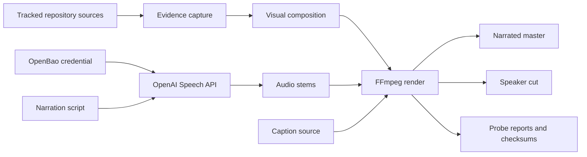
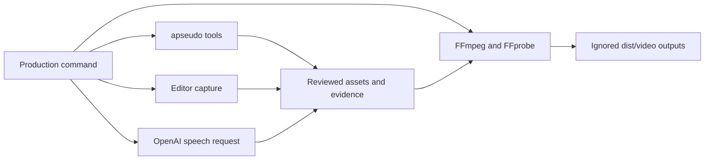
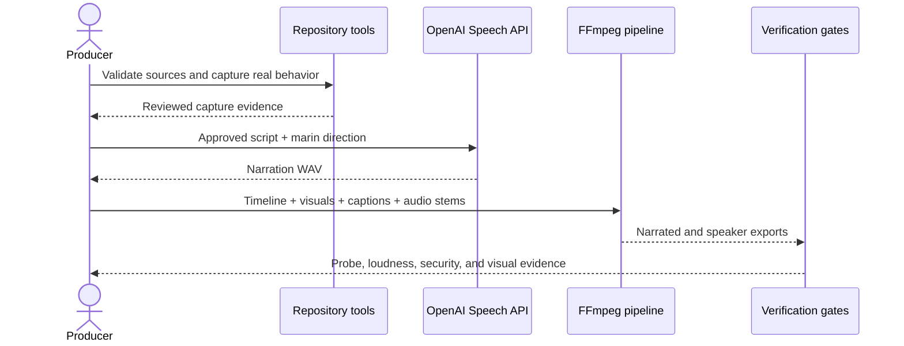
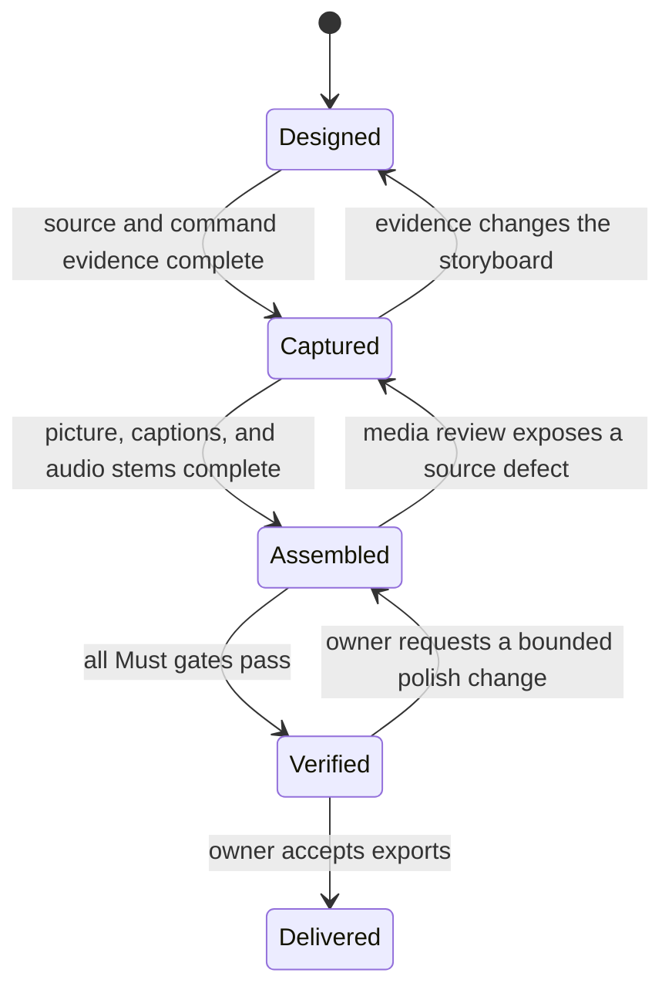

# `Repository Explainer Video` — Specification (Standard)

---

## Revision History

| Version | Date | Author | Change |
| --- | --- | --- | --- |
| 0.1 | `2026-07-23` | Chris Purcell | Initial draft from the approved video design. |

**Spec lifecycle:** This document is **living until `approved`**, then **change-controlled**: post-approval edits require a new revision row and, for scope-affecting changes, re-approval by the owner. Implementation deviations belong in the [Deviations Log](#deviations-log), not in silent requirement changes.

---

## 1. Purpose & Background

Pythonic Agent Pseudocode turns agent instructions into Python-shaped process definitions that people can inspect and tools can validate. The repository already contains the language convention, editor integrations, formatter, linter, language server, MCP server, hooks, CI integration, visualization tools, and executable runner. A developer evaluating the project from prose alone must still assemble those surfaces into one mental model.

This project will produce a conference-ready explainer film that demonstrates the toolkit through real repository artifacts and captured tool behavior. The film's central promise is:

> Agent behavior can be understandable enough to read and concrete enough to run.

The first release is optimized for a technical presentation. It must support a live speaker and also stand alone with calm narration and captions. The durable value is a reproducible media pipeline: future repository changes can replace captures, narration, or individual scenes without rebuilding the film from an opaque editing project.

---

## 2. Scope

### 2.1 In Scope

- A 1920×1080, 30 fps explainer film targeting 2 minutes 15 seconds.
- A six-scene narrative: ambiguity, readable workflow, caught defect, shared policy, guarded execution, and closing promise.
- Real editor and terminal interaction drawn from this repository.
- Brief motion-graphic system maps that explain how the shared policy core serves editors, agents, hooks, and CI.
- Calm neural narration using OpenAI `gpt-4o-mini-tts` with the `marin` voice.
- Burned-in English captions and a reusable caption source file.
- A narrated master and a live-speaker cut without narration.
- Reusable source assets, capture evidence, audio stems, and a deterministic FFmpeg render recipe.
- Media and repository validation sufficient to prove that displayed behavior is genuine and the exports are technically sound.

### 2.2 Out of Scope (Non-Goals — never)

| ID | Non-Goal | Reason |
| --- | --- | --- |
| NG-001 | Presenting fabricated terminal output or a synthetic successful runner result as real | Credibility is the film's central value; illustrative output must be visibly labeled rather than passed off as evidence. |
| NG-002 | Explaining every command or integration in the toolkit | A comprehensive tutorial would exceed conference pacing and obscure the core message. |
| NG-003 | Tracking credential values or billing data in the repository | OpenBao remains the credential system of record; the repository stores references only. |
| NG-004 | Building a general-purpose video editing framework | The production source may be reusable, but it exists to render this film rather than become a standalone product. |
| NG-005 | Using voice cloning or imitating a real person | A built-in disclosed synthetic voice is sufficient and avoids consent and likeness concerns. |

### 2.3 Won't Have in v1 (deferred — not never)

| ID | Deferred Capability | Why Deferred | Revisit When |
| --- | --- | --- | --- |
| WH-001 | Alternate aspect ratios such as vertical or square | The approved venue is a conference presentation, where 16:9 is the useful master. | A social or mobile distribution channel is selected. |
| WH-002 | Translated narration and captions | The target audience and approved script language are English. | A named event or audience requires another language. |
| WH-003 | A tracked binary MP4 in Git | Large generated binaries add repository weight and do not improve reproducibility. | The project adopts Git LFS or a release-asset publication workflow. |
| WH-004 | A human-recorded narration take | The approved first version uses the `marin` neural voice. | A speaker or voice actor supplies a recorded replacement stem. |

### 2.4 Boundaries

| Boundary | Description |
| --- | --- |
| System owns | Storyboard, script, capture manifest, visual assets, captions, audio stems, render recipe, QA evidence, and the generated video exports. |
| System depends on | Existing repository examples and CLIs, VS Code or an equivalent truthful editor capture, FFmpeg/FFprobe, Noto Sans fonts, OpenAI's Speech API, OpenBao, and a Codex or Claude runner backend for one bounded demonstration. |
| System does not own | Pythonic Agent Pseudocode semantics, APSEUDO rules, provider availability, conference playback hardware, OpenAI account policy, or long-term binary hosting. |

---

## 3. Context

### 3.1 Current State

The repository is on `main` and contains a working prototype at version 0.6.1. Its public story is distributed across `README.md`, `docs/usage.md`, feature guides, examples, test fixtures, and runner documentation. The strongest existing source artifacts for the film are:

- `docs/apseudo-docs/examples/review-loop.apseudo`, a readable bounded loop;
- `tests/fixtures/invalid/unbounded_while.apseudo`, a deliberate violation;
- `docs/apseudo-docs/examples/runner/review-spec.apseudo`, a read-only executable task;
- `docs/reference/RULES.md`, the rendered APSEUDO rule catalog;
- `docs/usage.md`, the CLI contract.

FFmpeg, FFprobe, VS Code, Noto Sans, and Noto Sans Mono are available on the reference workstation. OpenBao contains a project TTS credential reference. The browser brainstorming artifacts are exploratory only; no durable production assets or final video exist yet.

The repository's general Python gate currently fails on its pre-existing 62% coverage result against an 85% floor. That unrelated product backlog must not be presented as a failure of the video pipeline.

### 3.2 Target State

The repository contains a small, understandable source tree for the film and a single documented render entry point. Running the approved production flow recreates:

1. a narrated master with captions;
2. a speaker cut with music and cues but no narration;
3. caption and audio-stem files;
4. a machine-readable capture/verification record;
5. checksums for delivered artifacts.

Every terminal line presented as real traces to a captured command. Every displayed valid workflow passes the repository formatter and linter. The intentionally invalid workflow is clearly identified as a teaching state.

### 3.3 Assumptions

| ID | Assumption | Impact if False |
| --- | --- | --- |
| A-001 | Production source will live under `media/repository-explainer/`, while generated exports will live under ignored `dist/video/`. | Only paths and render configuration change; the narrative and media contract remain intact. |
| A-002 | The conference player accepts an H.264 video stream with AAC stereo audio in an MP4 container. | Add a venue-specific transcode without changing the master timeline. |
| A-003 | English captions and narration are sufficient for the first venue. | WH-002 must be reopened and the timeline may need adjustment for translated speech length. |
| A-004 | A truthful read-only runner demonstration can complete in a disposable Git workspace. | The scene stops at verified preflight and command rendering; it must not display a fabricated `Accepted` outcome. |

### 3.4 Constraints

| ID | Constraint | Source |
| --- | --- | --- |
| C-001 | The film shall work for developers evaluating the toolkit during a conference presentation. | Owner-approved design. |
| C-002 | The narrative shall combine the ideas “readable and executable” and “complex behavior made understandable.” | Owner-approved design. |
| C-003 | The visual mix shall be approximately 70% real tool interaction and 30% explanatory motion graphics. | Owner-approved hybrid approach. |
| C-004 | Narration shall use `gpt-4o-mini-tts` with voice `marin` and a calm, precise technical style. | Owner decision and OpenAI Speech API contract. |
| C-005 | Source and output must never contain credential values. | Repository credential policy. |
| C-006 | Displayed pseudocode shall use repository tooling and remain free of blocking APSEUDO diagnostics except for the explicitly labeled invalid teaching example. | `AGENTS.md` and the `agent-pseudocode` skill. |
| C-007 | TTS generation shall remain below USD 1 for this deliverable unless the owner approves additional spend. | Cost-control decision derived from the selected provider's token pricing. |
| C-008 | The film shall disclose that its narration is AI-generated. | OpenAI Text-to-Speech usage policy. |

---

## 4. Goals

| ID | Goal | Success Signal | Achieved By |
| --- | --- | --- | --- |
| G-001 | Make the repository's central value understandable to an evaluating developer. | A viewer can state that agent behavior is readable, verifiable, and executable after one viewing. | FR-001, FR-002, FR-003 |
| G-002 | Demonstrate that the toolkit is real rather than conceptual. | Every claimed tool interaction traces to captured repository behavior. | FR-004, FR-005, NFR-006 |
| G-003 | Deliver a conference-ready asset usable with or without a live speaker. | Both exports pass media checks and remain comprehensible when muted. | FR-006, FR-007, FR-008, NFR-003 |
| G-004 | Make future revisions bounded and reproducible. | A clean production run can replace one scene or audio stem and reproduce the exports. | FR-009, DR-001, DR-002, NFR-005 |

---

> **§5 (Stakeholders and Users) is Full-tier** and is intentionally omitted at the Standard profile.

## 6. Glossary

| Term | Definition | Notes / Not to be confused with |
| --- | --- | --- |
| Capture evidence | Stored command, source revision, output, and status that support an on-screen interaction. | Not a hand-authored terminal mockup. |
| Narrated master | The H.264/AAC MP4 containing narration, music/cues, and burned-in captions. | Distinct from the speaker cut. |
| Speaker cut | The same visual timeline without narration, retaining concise on-screen copy and the non-speech audio bed. | Intended to support a live presenter. |
| Teaching example | A deliberately invalid workflow shown so a diagnostic can correct it. | Must be labeled; it is not accepted source. |
| Truthful composite | A designed crop, zoom, or reconstruction whose source text and output come from real artifacts. | Layout may be polished; semantic content may not be altered. |
| Title-safe area | The central frame region kept clear of projector and presentation-player cropping. | Applied to code, captions, and essential labels. |

---

## 7. Requirements

### 7.1 Functional Requirements

| ID | Requirement | Rationale | Acceptance Criteria | Priority |
| --- | --- | --- | --- | --- |
| FR-001 | The film shall communicate that agent behavior can be read, understood, validated, and run. | This is the approved product promise. | The opening problem, workflow reveal, validation, execution, and end card form one coherent claim without requiring narration. | Must |
| FR-002 | The timeline shall use the approved six-scene narrative in the approved order. | The progression moves from developer pain to evidence and recall. | Scene markers and final render follow §10.1 with no missing stage. | Must |
| FR-003 | The film shall feature an actual Pythonic Agent Pseudocode workflow as its recurring visual subject. | The language shape is the repository's distinctive product surface. | The recurring workflow is sourced from a tracked or production-specific validated `.apseudo` file. | Must |
| FR-004 | Every interaction presented as real shall be generated from a recorded command or source capture at a named Git revision. | The film must earn developer trust. | The capture manifest maps each such scene to source, command, exit status, and stored output. | Must |
| FR-005 | The runner scene shall show successful execution only when a real read-only run and its deterministic post-checks pass. | A fake success result would contradict NG-001. | The displayed result matches a preserved run record from a disposable workspace; otherwise the scene ends at verified preflight. | Must |
| FR-006 | The pipeline shall produce a narrated master using `marin`. | The owner selected a calm technical neural voice. | The delivered narrated MP4 contains the approved script rendered with the selected model, voice, and direction. | Must |
| FR-007 | The pipeline shall produce a speaker cut without narration. | The same film must support a live presenter. | The speaker MP4 shares the visual timeline and contains no speech track. | Must |
| FR-008 | The film shall include burned-in English captions and a reusable caption source. | Muted playback must remain understandable. | Narrated copy is represented accurately in the caption source and visibly rendered within the title-safe area. | Must |
| FR-009 | The production source shall support deterministic replacement and re-rendering of individual captures, graphics, or audio stems. | The repository will evolve after this release. | A documented render command rebuilds both exports without manual timeline editing. | Must |
| FR-010 | The film shall disclose its AI-generated narration. | Provider policy requires clear disclosure. | The disclosure appears on the end card and in adjacent delivery metadata. | Must |

### 7.2 Non-Functional Requirements

| ID | Category | Requirement | Measurement / Acceptance Criteria | Priority |
| --- | --- | --- | --- | --- |
| NFR-001 | Format | The master shall be 1920×1080 at 30 progressive frames per second. | FFprobe reports `1920x1080`, 30 fps, H.264 video, AAC stereo audio, and an MP4 container. | Must |
| NFR-002 | Duration | The narrated master shall run between 125 and 145 seconds. | FFprobe duration lies within the range. | Must |
| NFR-003 | Accessibility | Essential meaning shall remain available without audio. | Captions and on-screen copy cover the complete narrative; a muted manual review can identify all six scenes and the closing promise. | Must |
| NFR-004 | Legibility | Essential code, command, caption, and label text shall remain readable from a conference screen. | At 1080p, captions are at least 44 px, primary code is at least 32 px, critical text remains title-safe, and contrast is at least 4.5:1 except for decorative elements. | Must |
| NFR-005 | Reproducibility | Identical approved inputs shall render equivalent output streams. | The render command completes from a clean checkout; nondeterministic metadata is excluded from content comparisons. | Must |
| NFR-006 | Authenticity | Designed composites shall not change the semantic content of captured source or output. | A side-by-side evidence review finds no altered command, diagnostic, rule code, outcome, or source statement. | Must |
| NFR-007 | Audio quality | Narration shall be clear over the background bed. | Final mix measures approximately −16 LUFS integrated (±1 LU) with true peak no higher than −1 dBTP; laptop and conference-playback spot checks remain intelligible. | Must |
| NFR-008 | Security | Production logs, source, and exports shall contain no credential value. | Secret-pattern and high-entropy scans return no material finding; manual diff review confirms only references remain. | Must |
| NFR-009 | Cost | Bounded TTS generation shall remain within C-007. | Usage attributable to narration remains below USD 1 or has recorded owner approval. | Should |

### 7.3 Interface Requirements

| ID | Interface | Requirement | Contract / Format | Acceptance Criteria |
| --- | --- | --- | --- | --- |
| IR-001 | Repository source | The capture stage shall read tracked examples, docs, and CLI output without modifying product behavior. | Git paths named in §3.1 and production-specific media sources. | Product-source diff remains empty after capture except for intentional media-source work. |
| IR-002 | OpenAI Speech API | The narration stage shall call only the speech-generation endpoint with the approved model, voice, input, and instructions. | `POST /v1/audio/speech`; WAV response; restricted key with Speech write access. | A valid narration WAV is created; the key does not need access to unrelated endpoints. |
| IR-003 | FFmpeg/FFprobe | The render stage shall create and inspect the delivery artifacts through command-line interfaces. | H.264/AAC MP4, WAV stems, SRT captions, JSON or text probe reports. | Render and probe commands exit zero and match NFR-001, NFR-002, and NFR-007. |
| IR-004 | Runner | The execution scene shall use `apseudo-run` preflight surfaces before a bounded read-only provider invocation. | `--check`, `--render-prompt`, `--print-command`, `--run-dir`, read-only sandbox, no-diff postcondition. | Preflights pass and the preserved run record proves the displayed result. |
| IR-005 | Delivery files | The production flow shall emit stable, descriptive filenames. | `agent-pseudocode-explainer-narrated.mp4`, `agent-pseudocode-explainer-speaker.mp4`, caption/audio stems, and checksums. | Every required deliverable exists and its checksum is recorded. |

### 7.4 Data Requirements

| ID | Data Entity | Requirement | Validation Rules | Ownership |
| --- | --- | --- | --- | --- |
| DR-001 | Capture manifest | The pipeline shall retain provenance for every real interaction used in the film. | Records Git revision, source path, exact argv, exit status, output path, and capture timestamp; never stores environment values. | Repository media source |
| DR-002 | Narration package | The pipeline shall retain the approved narration text, direction, voice identifier, captions, and selected WAV. | Text and captions agree; voice is `marin`; WAV passes probe and loudness checks. | Repository media source, except generated WAV when intentionally untracked |
| DR-003 | Render manifest | The pipeline shall record scene order, timing, asset checksums, and export checksums. | All references resolve; durations fit the timeline; checksums match delivered files. | Repository media source and delivery bundle |
| DR-004 | Temporary run data | The pipeline shall isolate transient TTS responses, runner records, and render intermediates from unrelated repository state. | Temporary paths are explicit, ignored, and removable; final evidence is copied selectively after review. | Local production workspace |

---

## 8. Architecture and Design

### 8.1 Architecture Summary

The production pipeline has five stages: source selection, evidence capture, visual composition, narration/audio, and final rendering. Source selection binds every scene to tracked repository artifacts. Evidence capture executes the actual formatter, linter, rule explanation, Mermaid, and runner preflight surfaces and records their outputs. Visual composition turns those sources into large-screen editor and terminal scenes without changing semantic content. Narration uses one OpenAI Speech API call path with an OpenBao-sourced key and a replaceable WAV stem. FFmpeg assembles the visual timeline, captions, narration, music, and cues into the two exports.

Trust boundaries are explicit. OpenBao owns the credential value. The OpenAI request receives only the narration script and delivery instructions. The runner executes only in a disposable Git workspace under read-only/no-diff controls. Generated outputs do not become evidence until their source and status have been reviewed.

### 8.2 Architecture Views

#### 8.2.1 Context View

#### 8.2.2 Container / Deployment View

This project has no deployed service. It runs as a bounded production job on the workstation:

#### 8.2.3 Component View

| Component | Responsibility | Interfaces | Notes |
| --- | --- | --- | --- |
| Source ledger | Maps scenes to repository evidence and commands. | Git, files, capture manifest | Authoritative for authenticity review. |
| Capture stage | Runs and records real tool behavior. | `apseudo-*`, VS Code, runner | Must not mutate product behavior. |
| Visual stage | Produces editor macros, terminal frames, system maps, captions, and transitions. | Source/capture assets to frame sequences | May crop or animate, never rewrite evidence. |
| Narration stage | Generates and normalizes the `marin` voice track. | OpenBao environment to OpenAI Speech API to WAV | Paid and retry-bounded. |
| Render stage | Assembles scenes and audio into delivery files. | FFmpeg | Produces narrated and speaker cuts from one timeline. |
| QA stage | Validates pseudocode, evidence, security, media streams, loudness, captions, and representative frames. | Repository tools, scans, FFprobe, manual review | Blocks delivery on a Must failure. |

### 8.3 Design Decisions

| ID | Decision | Rationale | Alternatives Considered | ADR |
| --- | --- | --- | --- | --- |
| D-001 | Use an editor-first hybrid film: approximately 70% real interaction and 30% system-map motion graphics. | Developers need proof and architecture; either mode alone loses one of those. | Pure screen documentary (too flat for a large room); full motion graphics (too conceptual). | — |
| D-002 | Use a six-scene, 2:15 narrative ending with “Behavior you can read. Work you can run.” | The arc makes one memorable promise and keeps conference pacing bounded. | Feature catalog (rejected as diffuse); tutorial (rejected as too long). | — |
| D-003 | Use Noto Sans and Noto Sans Mono over an ink/blue/mint/coral palette. | The fonts are present, readable, open, and suited to source code; colors encode structure, success, and diagnostics. | Decorative or brand-heavy treatment (rejected as less credible for developers). | — |
| D-004 | Use OpenAI `gpt-4o-mini-tts` voice `marin` with a calm technical direction. | The owner selected it after comparing neural-voice quality and cost. | Local eSpeak-NG (less natural); ElevenLabs (quality alternative but another account and plan). | — |
| D-005 | Produce both narrated and speaker cuts from one visual timeline. | This satisfies standalone and live-presentation use without divergent edits. | One narrated file only (poor live-speaker fit); separate edits (drift risk). | — |
| D-006 | Keep generated MP4s under ignored `dist/video/` and keep reproducible source in Git. | Generated binaries are large; repeatable source and release checksums are the maintainable assets. | Commit MP4s directly (repository growth); opaque external editor project (poor reproducibility). | — |

### 8.5 Design Constraints

- A real interaction may be cropped, zoomed, color-corrected, or re-timed, but its semantic content must remain unchanged.
- A runner success may appear only after a real read-only execution and no-diff postcondition.
- The invalid teaching example must never be confused with accepted source.
- Narration, captions, and scene timing must derive from one approved script.
- A single timeline definition must drive both final exports.
- OpenBao and environment variables are the only credential handoff boundary.
- No render step may echo its process environment or authorization headers.
- Mermaid and motion graphics explain relationships; they are not presented as the language's source of truth.

---

## 9. Data Model

The project owns no database. Durable source is a set of versioned text, graphics, and manifests keyed by stable scene IDs. Each scene record includes an ID, start/end time, visual source, evidence record where applicable, caption intervals, and audio cues. Asset paths are repository-relative; generated artifacts carry SHA-256 checksums.

Transient media, provider responses, and runner logs live only under ignored production directories until reviewed. The final evidence subset is promoted by explicit file selection rather than copying an entire run directory.

---

## 10. Behavior and Workflows

### 10.1 Primary Workflow

The approved timeline is:

1. **00:00–00:15 — The problem.** Dense prose asks, “What will the agent actually do?”
2. **00:15–00:35 — Make it visible.** A Python-shaped workflow becomes the recurring visual subject.
3. **00:35–01:00 — Catch ambiguity.** An unbounded loop receives an `APSEUDO-WHILE-001` diagnostic and becomes bounded.
4. **01:00–01:25 — One shared truth.** A short system map shows the shared core feeding editor, MCP, runner, hooks, pre-commit, and CI.
5. **01:25–01:55 — Run with guardrails.** Runner preflight leads to a real bounded read-only outcome when A-004 holds.
6. **01:55–02:15 — The promise.** The film closes on “Behavior you can read. Work you can run,” the repository name, and the AI-narration disclosure.

Expected result: both export variants pass §17 and tell the same story.

### 10.2 Alternate Workflows

| ID | Trigger | Behavior | Expected Result |
| --- | --- | --- | --- |
| AW-001 | The live speaker does not want recorded narration. | Use the speaker cut while retaining on-screen copy, music, and cues. | The six-scene story remains understandable. |
| AW-002 | A narration line changes after picture lock. | Regenerate only the affected TTS segment and re-time its captions within the unchanged scene boundary. | The master changes without rebuilding unrelated captures. |
| AW-003 | The real runner result is not `Accepted`. | Use verified preflight and explain the guarded launch boundary without displaying a success outcome. | The scene remains truthful and the closing claim is limited to executability rather than a fabricated result. |

### 10.3 Edge Cases

| ID | Edge Case | Expected Behavior |
| --- | --- | --- |
| EC-001 | A command or diagnostic changes before capture. | Update the storyboard copy to the current truth or pin the capture to its named revision; never combine mismatched versions. |
| EC-002 | Source lines exceed the conference-safe frame width. | Reframe into multiple truthful macro shots rather than shrinking below NFR-004. |
| EC-003 | Captions exceed two lines or obscure essential code. | Shorten display copy without changing meaning and re-time captions; narration script remains the source. |
| EC-004 | The TTS provider returns an unsuitable pronunciation of a project term. | Adjust punctuation or delivery instructions and regenerate within the bounded retry policy. |
| EC-005 | An output scan matches a benign high-entropy checksum. | Review and allowlist that artifact type locally; do not weaken scans over logs or source. |

### 10.4 State Transitions

| State | Meaning | Entry Condition | Exit Condition |
| --- | --- | --- | --- |
| Designed | Approved narrative and production contract exist. | This specification is review-ready. | Capture evidence is complete. |
| Captured | Required real interactions and source assets are preserved. | FR-004 evidence is complete. | Timeline and audio are assembled. |
| Assembled | Both candidate exports exist. | All scenes and stems render. | QA passes or returns a precise defect. |
| Verified | Candidate exports satisfy every Must gate. | §17 checks pass. | Owner accepts delivery or requests bounded polish. |
| Delivered | Final artifacts and source handoff are complete. | Owner acceptance. | Terminal state for v1. |

---

## 11. UI Pages / API Endpoints

Not applicable: the deliverable exposes no shipped UI or API; build-time interfaces are specified in §7.3.

---

## 12. Error Handling and Recovery

### 12.1 Expected Failures

| ID | Failure Mode | User/System Behavior | Logging / Observability | Recovery |
| --- | --- | --- | --- | --- |
| ERR-001 | A displayed valid workflow fails formatting or linting. | Rendering stops before export. | Formatter/linter output names the file and APSEUDO code. | Correct the production source, explain the rule when needed, and rerun both checks. |
| ERR-002 | Runner preflight or execution fails. | The film does not show a successful outcome. | Preserve preflight output and the normalized run record without environment values. | Repair the bounded demo or use AW-003. |
| ERR-003 | OpenAI rejects, times out, or returns unsuitable narration. | The failed take is excluded from the timeline. | Record failure class and take number, not headers or key material. | Retry at most three total takes for the unchanged script; stop for configuration/auth failures. |
| ERR-004 | FFmpeg or FFprobe fails. | No candidate is promoted to Verified. | Preserve command, exit status, stderr, and the affected artifact path. | Correct the asset or render configuration and rebuild from the last reviewed inputs. |
| ERR-005 | A secret scan reports a material finding. | Delivery stops and affected artifacts are quarantined locally. | Record the file path and finding class without copying the matched value. | Remove the leaked artifact, rotate if exposure is plausible, regenerate, and rerun the scan. |
| ERR-006 | Captions drift or obscure essential content. | Candidate fails accessibility review. | Caption QC notes identify time interval and defect. | Retiming or copy correction followed by a full muted review. |

### 12.2 Retry and Idempotency

- TTS transport or provider failures may be retried, but the approved script, model, voice, and instructions remain fixed per take series. At most three total takes are generated without owner approval.
- Authentication, permission, billing, policy, and malformed-request failures are configuration failures and are not retry-looped.
- Capture and render commands may be rerun because outputs are written to explicit scene/take paths and final filenames are promoted only after QA.
- A content hash over script, voice, instructions, and source revision identifies each narration/render input set.
- Runner provider retries use the runner's bounded option and remain read-only; they may not bypass hooks, post-checks, or diff policy.

### 12.3 Rollback / Recovery

Generated artifacts are replaceable. A failed or disliked render is recovered by retaining the last Verified output, reverting only the affected source asset or timeline change, and rendering a new candidate with a new manifest. No database or remote state must be rolled back. If a credential may have entered an artifact or process output, stop production, delete the affected local artifacts, rotate the key in OpenBao, and rerun from reviewed source.

---

## 13. Security and Privacy

### 13.1 Authentication

The narration process authenticates to OpenAI with a project-scoped, user-owned API key resolved from OpenBao at runtime. The key is configured as Restricted with Write access to the Speech endpoint and no access to unrelated endpoints. The runner backend uses the workstation's existing provider authentication and executes in a disposable read-only workspace.

### 13.2 Authorization

| Actor / Role | Allowed Actions | Denied Actions |
| --- | --- | --- |
| Owner | Approve script, media, external spend, and final delivery. | No restriction within the owner's accounts, subject to repository policy. |
| Production process | Read approved repository sources, request speech, write ignored local media, and run bounded validation/capture commands. | Reading unrelated secrets, changing product behavior for visual convenience, publishing artifacts, or broad API use. |
| Runner demonstration | Read the disposable workspace and return a normalized outcome. | Writing source, escaping the workspace, bypassing hooks/post-checks, or retaining unrelated context. |

### 13.3 Secrets

| Secret | Storage Location | Access Pattern | Rotation / Notes |
| --- | --- | --- | --- |
| `OPENAI_API_KEY` | OpenBao `secret/api-keys/ai/openai-tts` | Resolved into the narration process environment; sent only as the Speech API bearer credential. | Rotate in OpenBao after suspected exposure; source and docs retain references only. |

### 13.4 Sensitive Data

| Data | Classification | Storage | Transmission | Retention |
| --- | --- | --- | --- | --- |
| OpenAI API key | Restricted | OpenBao and process memory | Tailscale to OpenBao; TLS to OpenAI | Never retained in production assets or logs. |
| Narration script and generated voice | Public after release | Repository text and local media assets | TLS to/from OpenAI | Retained with the production source and delivery package. |
| Runner/capture logs | Internal before review | Ignored production workspace; reviewed subset may become source evidence | Local filesystem | Keep only the minimal evidence required to reproduce scenes. |

### 13.5 Threats and Mitigations

| Threat | Impact | Mitigation |
| --- | --- | --- |
| Credential leakage through shell tracing, environment dumps, or captured terminal footage | Unauthorized API use | No shell tracing, no environment capture, restricted key, secret scans, and manual evidence review. |
| Fabricated or stale tool output | Loss of developer trust | Capture manifest, revision pinning, command replay, and semantic comparison. |
| Runner modifies repository state | User work loss or misleading scene | Disposable workspace, read-only sandbox, no-diff policy, post-checks, and run record. |
| Unlicensed music, fonts, or imagery | Distribution restriction | Use installed open fonts and procedurally generated or license-verified audio/graphics; preserve provenance. |
| Prompt or source content sent unnecessarily to TTS | Unintended data disclosure | Send only the approved public narration script and delivery instructions. |

### 13.6 Hardening Checklist

- [x] Cookie/session settings: not applicable; no web session is shipped.
- [x] CSRF/CORS policy: not applicable; no browser API is shipped.
- [x] Webhook/API signature validation: not applicable; no webhook is consumed.
- [ ] Sensitive-data redaction in logs: required by NFR-008 and ERR-005.
- [ ] CI/CD secret handling: the render stays local and must never print or commit the key.
- [x] Network exposure: no listener or service is created.
- [x] Identity-header trust rules: not applicable; no authentication proxy is involved.
- [ ] Least privilege: the OpenAI key and runner sandbox must match §13.1–§13.3.

---

> **Sections §14 (Capacity and Scale Assumptions), §15 (Risks), and §16 (Compliance, Licensing, and Data Rights) are Full-tier** and are intentionally omitted at the Standard profile. This specification remains Standard because the paid API is a bounded build-time media input, not a shipped or recurring service. Cost, provider terms, disclosure, rights, retry, and credential controls are nevertheless explicit in C-007, C-008, §12, and §13.

## 17. Testing and Acceptance

### 17.1 Definition of Done

- [ ] All Must requirements are implemented and have Passing evidence in §17.3.
- [ ] The displayed valid pseudocode passes the formatter and linter; the teaching example remains explicitly labeled.
- [ ] Actual capture commands replay from the recorded Git revision.
- [ ] Both MP4 variants pass media, duration, stream, loudness, and caption checks.
- [ ] Muted and audio-enabled reviews both communicate the six-scene story.
- [ ] Representative frames pass large-screen legibility and title-safe inspection.
- [ ] Security scans and manual review find no credential value.
- [ ] AI narration disclosure and asset provenance are present.
- [ ] Reusable source, stems, captions, manifests, checksums, and render instructions are delivered.
- [ ] Deviations and non-blocking open questions are accepted by the owner.

### 17.2 Test Strategy

| Layer | Scope | Required Coverage | Required? |
| --- | --- | --- | --- |
| Source validation | Displayed `.apseudo` sources and Markdown | Format check before lint; zero blockers outside the labeled teaching example. | Yes |
| Integration | OpenAI speech request and runner demonstration | Successful speech take; auth/permission failure handling; runner preflight and no-diff result. | Yes |
| Snapshot / contract | Capture and render manifests | Stable scene IDs, source/command provenance, timing, and checksums. | Yes |
| End-to-end | Full render | Both variants from clean inputs; happy path plus one rejected-candidate path. | Yes |
| Security | Logs, source, intermediates, and exports | Secret-pattern scan and manual review of every promoted capture. | Yes |
| Media | Video, audio, and captions | FFprobe streams/duration, loudness analysis, caption timing, representative frame inspection. | Yes |
| Regression | Final approved package | Re-render from unchanged inputs and compare semantic manifests/checksums where deterministic. | Yes |

### 17.3 Requirement-to-Test Traceability

| Requirement ID | Test / Verification Method | Status |
| --- | --- | --- |
| FR-001 | Muted and narrated owner review against the approved promise. | Not Started |
| FR-002 | Timeline manifest contains the six ordered scene IDs and approved intervals. | Not Started |
| FR-003 | Formatter/linter output for the recurring tracked workflow. | Not Started |
| FR-004 | Capture-manifest schema check plus manual evidence comparison. | Not Started |
| FR-005 | Preserved runner preflights, run record, changed-file report, and no-diff postcondition. | Not Started |
| FR-006 | FFprobe confirms narrated master audio; TTS manifest confirms `marin`. | Not Started |
| FR-007 | Speaker-cut audio inspection confirms no speech stem. | Not Started |
| FR-008 | Caption parser/timing check and full muted review. | Not Started |
| FR-009 | Clean-checkout render and bounded single-scene replacement rehearsal. | Not Started |
| FR-010 | End-card frame and delivery metadata inspection. | Not Started |
| NFR-001 | FFprobe stream report. | Not Started |
| NFR-002 | FFprobe duration report. | Not Started |
| NFR-003 | Muted manual review. | Not Started |
| NFR-004 | Automated text-size/contrast assertions where encoded, plus representative-frame inspection. | Not Started |
| NFR-005 | Clean render plus semantic manifest comparison. | Not Started |
| NFR-006 | Side-by-side source/capture review. | Not Started |
| NFR-007 | FFmpeg EBU R128 analysis and playback spot checks. | Not Started |
| NFR-008 | Secret scan plus reviewed Git diff. | Not Started |
| NFR-009 | OpenAI usage/cost review for the take series. | Not Started |
| IR-001 | Product-source diff review after capture. | Not Started |
| IR-002 | Restricted-key Speech API smoke test without unrelated endpoint access. | Not Started |
| IR-003 | Render and probe command logs. | Not Started |
| IR-004 | Runner check/render/print-command/run evidence. | Not Started |
| IR-005 | Delivery file inventory and SHA-256 manifest. | Not Started |
| DR-001 | Capture-manifest validation. | Not Started |
| DR-002 | Narration/caption consistency and audio probe. | Not Started |
| DR-003 | Render-manifest path/timing/checksum validation. | Not Started |
| DR-004 | Ignored-workspace and promotion-scope inspection. | Not Started |

---

## 18. Deployment and Operations

### 18.1 Runtime Environment

| Item | Value |
| --- | --- |
| Runtime | Repository Python/Node tooling where needed; FFmpeg/FFprobe for media |
| OS / Platform | Reference Linux workstation |
| Datastore | None |
| External services | OpenAI Speech API; existing Codex or Claude runner backend |
| Scheduling | Manual bounded production run |
| Hosting | Generated files under local ignored `dist/video/`; publication is separate |

Runtime services: none. Health is the successful completion of source, render, probe, security, and manual acceptance gates.

### 18.2 Configuration

| Setting | Required? | Default | Description |
| --- | --- | --- | --- |
| `OPENAI_API_KEY` | Yes for narrated master | None | Restricted Speech API credential resolved from OpenBao. |
| TTS model | Yes | `gpt-4o-mini-tts` | Approved speech model. |
| TTS voice | Yes | `marin` | Approved narration voice. |
| Frame size | Yes | `1920x1080` | Conference master dimensions. |
| Frame rate | Yes | `30` | Progressive frames per second. |
| Output root | No | `dist/video/` | Ignored generated-delivery directory. |

Environment matrix: none. The same local production flow creates all deliverables; there is no staging or deployed runtime.

### 18.3 Deployment Flow

1. Approve and lock the narration script and scene copy.
2. Validate production pseudocode and capture repository/tool evidence.
3. Generate and review visual assets.
4. Resolve the OpenAI key from OpenBao and generate bounded `marin` takes.
5. Select and normalize the narration; finalize captions.
6. Render narrated and speaker candidates from one timeline.
7. Run source, security, media, loudness, caption, and checksum checks.
8. Perform narrated, muted, and representative-frame reviews.
9. Promote candidates to final filenames and record checksums.
10. Rollback by restoring the last Verified files and manifest; generated artifacts have no irreversible deployment state.

> **§18.4 (Rollout Controls) is Full-tier** and is intentionally omitted at the Standard profile.

### 18.5 Observability

This is a finite job rather than a service. Its observability surface is the capture manifest, per-stage exit status, render log, FFprobe reports, loudness analysis, security-scan result, frame-review checklist, and final checksum manifest. A stage failure blocks promotion and points to its source asset or command.

### 18.6 Backup and Disaster Recovery

Not applicable: the project owns no database or irreplaceable runtime state. Committed source is protected by Git; generated media can be reproduced from reviewed source and external speech generation.

### 18.7 Documentation Deliverables

- [ ] This specification remains the design and acceptance source.
- [ ] A concise render/readme document names prerequisites, the render command, outputs, and verification commands.
- [ ] The production manifest names source revision, scenes, assets, and checksums.
- [ ] Credential documentation contains references only.
- [ ] Handoff status is updated at implementation closeout.

---

## 19. Implementation Plan

This milestone ladder defines proof boundaries; a later implementation plan will break them into test-first tasks.

### MS-0 — Source and narrative lock

1. Establish the production source tree and ignored output/intermediate paths.
2. Write the final narration and caption source against the approved timeline.
3. Select exact repository examples and commands for every real interaction.
4. Define the capture and render manifest shapes.

### MS-1 — Evidence and visual assets

1. Validate all displayed pseudocode in the required formatter-then-linter order.
2. Capture real editor, diagnostic, Mermaid, runner-preflight, and runner evidence at a named revision.
3. Produce conference-safe editor/terminal macros and system-map graphics.
4. Pass authenticity and secret-exposure review before composition.

### MS-2 — Narration and assembly

1. Generate bounded `marin` narration takes from the locked script.
2. Select, normalize, and stem the narration and background audio.
3. Assemble all scenes and captions into the shared timeline.
4. Render narrated and speaker candidates.

### MS-3 — Verification and delivery

1. Run the complete §17 gate.
2. Correct failed source, caption, audio, visual, or media checks and rerender.
3. Promote the accepted files, write checksums, and preserve reusable sources.
4. Update repository handoff artifacts and deliver clickable output paths.

### Milestone Summary

| Milestone | Deliverable | Exit Criteria |
| --- | --- | --- |
| MS-0 Source and narrative lock | Approved source ledger, script, captions, and manifests | No placeholder or unresolved scene content remains. |
| MS-1 Evidence and visual assets | Reviewed truthful captures and graphics | FR-003–FR-005, NFR-006, and NFR-008 evidence passes. |
| MS-2 Narration and assembly | Both candidate exports | All six scenes render with selected audio and captions. |
| MS-3 Verification and delivery | Final package | Every Must row in §17.3 is Passing and owner accepts the outputs. |

---

> **§20 (Success Evaluation) is Full-tier** and is intentionally omitted at the Standard profile.

## 21. Open Questions and Decisions

| ID | Question | Current Assumption | Blocking? | Owner | Needed By | Status |
| --- | --- | --- | --- | --- | --- | --- |
| OQ-001 | Should the final MP4 later be published as a GitHub release asset or hosted elsewhere? | Deliver locally under ignored `dist/video/`; publication is outside v1. | No | Chris Purcell | After MS-3 | Open |
| OQ-002 | Will the conference venue supply a codec, loudness, or safe-area specification? | Use the delivery contract in NFR-001, NFR-004, and NFR-007. | No | Chris Purcell | Before venue delivery | Open |

---

## Deviations Log

No implementation deviations are recorded before production begins.

---

## References

### Standards

- ISO/IEC/IEEE 29148:2018 — Requirements engineering.
- IEEE 1016-2009 — Software Design Description.
- ISO/IEC/IEEE 42010:2022 — Architecture description.
- OpenAI, [Text to speech](https://developers.openai.com/api/docs/guides/text-to-speech), accessed `2026-07-23`.
- OpenAI, [Assign API Key Permissions](https://help.openai.com/en/articles/8867743-assign-api-key-permissions), accessed `2026-07-23`.

### Project References

- `README.md` — product summary and core commands.
- `docs/usage.md` — CLI reference.
- `docs/specs/apseudo-validation-toolchain.md` (`SPEC-QZXW`) — validation architecture and requirements.
- `docs/apseudo-docs/examples/review-loop.apseudo` — recurring readable workflow candidate.
- `tests/fixtures/invalid/unbounded_while.apseudo` — teaching diagnostic source.
- `docs/apseudo-docs/examples/runner/review-spec.apseudo` — runner demonstration candidate.
- `docs/reference/RULES.md` — APSEUDO rule catalog.
- `docs/handoff/credentials.md` — repository credential references.

---

## Appendix A: ID Conventions

| Prefix | Meaning                     | Defined In     |
| ------ | --------------------------- | -------------- |
| `G-`   | Goal                        | §4             |
| `NG-`  | Non-goal (never)            | §2.2           |
| `WH-`  | Won't have in v1 (deferred) | §2.3           |
| `A-`   | Assumption                  | §3.3           |
| `C-`   | Constraint                  | §3.4           |
| `FR-`  | Functional requirement      | §7.1           |
| `NFR-` | Non-functional requirement  | §7.2           |
| `IR-`  | Interface requirement       | §7.3           |
| `DR-`  | Data requirement            | §7.4           |
| `D-`   | Design decision             | §8.3           |
| `AW-`  | Alternate workflow          | §10.2          |
| `EC-`  | Edge case                   | §10.3          |
| `ERR-` | Error-handling requirement  | §12.1          |
| `MS-`  | Milestone                   | §19            |
| `OQ-`  | Open question               | §21            |
| `DEV-` | Deviation                   | Deviations Log |

The `R-` prefix is Full-tier and is not used. Priority values are column values, not ID prefixes; IDs do not change when priorities change.

---

## Appendix B: Agent Implementation Contract

Binding when this specification is implemented by a coding agent.

### B.1 Implementation Rules

The implementer shall:

- Read this entire specification before changing production source; on later sessions, reread at least §7, §21, and the Deviations Log.
- Preserve every non-goal, deferred capability, constraint, and design constraint.
- Treat Must requirements and blocking open questions as hard gates.
- Record underspecified behavior as an `OQ-` row and any divergence as a `DEV-` row instead of guessing silently.
- Keep §17.3 current with actual evidence.
- Follow the milestone order and do not build later media on unreviewed source.
- Use the repository's Pythonic Agent Pseudocode tooling for every new or changed workflow and report formatter/linter status at completion.
- Keep credential values out of source, logs, captures, terminal output, and final media.

### B.2 Prohibited Behaviors

The implementer shall not:

- Invent features or messages absent from this specification.
- Modify product behavior merely to simplify filming.
- Fake terminal output, diagnostics, tool success, or runner outcomes.
- Bypass hooks, runner post-checks, diff policy, pre-commit, or CI.
- Disable validation or suppress an APSEUDO rule to make a scene pass.
- Send repository source, logs, or secrets to the TTS provider; only the approved public narration script and delivery instruction may leave.
- Mark a requirement complete without a verification entry in §17.3.

### B.3 Required Completion Report (verification gate)

At completion, provide:

- final narrated and speaker-cut paths;
- production-source and reusable-asset paths;
- requirements implemented, each mapped to its §17.3 evidence;
- tests and commands actually run;
- narration model, voice, disclosure, and bounded-spend result;
- pseudocode formatter/linter status;
- media, loudness, caption, authenticity, and secret-scan results;
- deviations, limitations, and remaining open questions.

### B.4 Session Handoff

For multi-session production, record the current milestone, in-progress requirement IDs, and unresolved `OQ-`/`DEV-` items in `docs/handoff/` at closeout. The specification records what and why; handoff records current execution state.

---

> **Appendix C (Optional Modules) is Full-tier** and is intentionally omitted.

## Appendix D: Tailoring

Standard is the smallest profile that represents this production. Light would omit the credential, external API, failure-recovery, operations, and traceability detail required by the approved design. Full would add stakeholder, capacity, risk, compliance, rollout, and success-evaluation sections intended for a shipped multi-service system. The OpenAI call here is a bounded build-time media input with an explicit USD 1 cap, not a recurring runtime integration, so Standard remains proportional.
